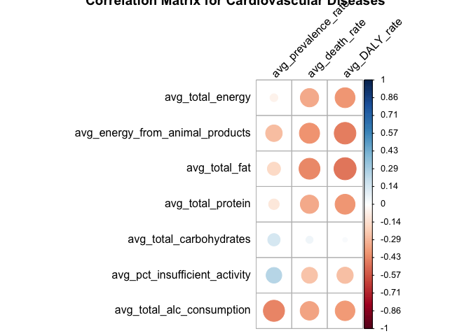
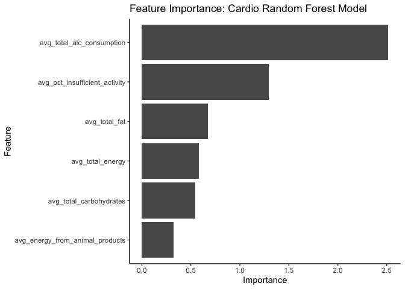
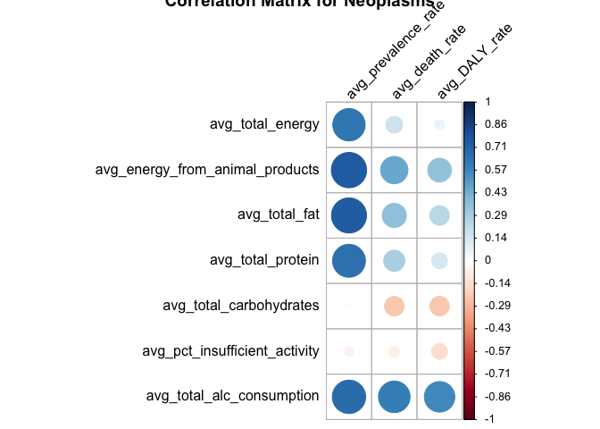
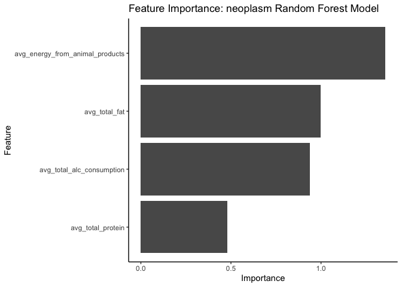
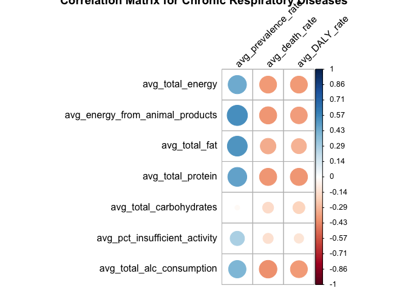
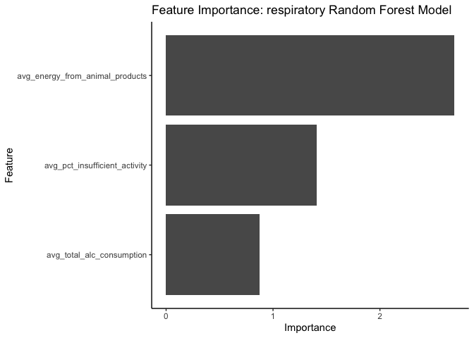

Global Nutrition and Health: Analyzing the Relationship Between Diet
Composition and Disease Prevalence
================
Meme Habel
2024-07-12

# Capstone Code File

## Preparation

### Load Libraries

``` r
library(tidyverse)  
```

    ## ── Attaching core tidyverse packages ──────────────────────── tidyverse 2.0.0 ──
    ## ✔ dplyr     1.1.4     ✔ readr     2.1.5
    ## ✔ forcats   1.0.0     ✔ stringr   1.5.1
    ## ✔ ggplot2   3.5.0     ✔ tibble    3.2.1
    ## ✔ lubridate 1.9.3     ✔ tidyr     1.3.0
    ## ✔ purrr     1.0.2     
    ## ── Conflicts ────────────────────────────────────────── tidyverse_conflicts() ──
    ## ✖ dplyr::filter() masks stats::filter()
    ## ✖ dplyr::lag()    masks stats::lag()
    ## ℹ Use the conflicted package (<http://conflicted.r-lib.org/>) to force all conflicts to become errors

``` r
library(readxl)
library(reshape2)
```

    ## 
    ## Attaching package: 'reshape2'
    ## 
    ## The following object is masked from 'package:tidyr':
    ## 
    ##     smiths

``` r
library(gridExtra)
```

    ## 
    ## Attaching package: 'gridExtra'
    ## 
    ## The following object is masked from 'package:dplyr':
    ## 
    ##     combine

``` r
library(corrplot)
```

    ## corrplot 0.92 loaded

``` r
library(randomForest)
```

    ## randomForest 4.7-1.1
    ## Type rfNews() to see new features/changes/bug fixes.
    ## 
    ## Attaching package: 'randomForest'
    ## 
    ## The following object is masked from 'package:gridExtra':
    ## 
    ##     combine
    ## 
    ## The following object is masked from 'package:dplyr':
    ## 
    ##     combine
    ## 
    ## The following object is masked from 'package:ggplot2':
    ## 
    ##     margin

``` r
library(gbm)
```

    ## Loaded gbm 2.1.9
    ## This version of gbm is no longer under development. Consider transitioning to gbm3, https://github.com/gbm-developers/gbm3

``` r
library(neuralnet)
```

    ## 
    ## Attaching package: 'neuralnet'
    ## 
    ## The following object is masked from 'package:dplyr':
    ## 
    ##     compute

``` r
library(regclass)
```

    ## Loading required package: bestglm
    ## Loading required package: leaps
    ## Loading required package: VGAM
    ## Loading required package: stats4
    ## Loading required package: splines
    ## Loading required package: rpart
    ## Important regclass change from 1.3:
    ## All functions that had a . in the name now have an _
    ## all.correlations -> all_correlations, cor.demo -> cor_demo, etc.

``` r
library(pdp)
```

    ## 
    ## Attaching package: 'pdp'
    ## 
    ## The following object is masked from 'package:purrr':
    ## 
    ##     partial

``` r
library(cluster)
library(factoextra)
```

    ## Welcome! Want to learn more? See two factoextra-related books at https://goo.gl/ve3WBa

``` r
library(DAAG)
library(caret)
```

    ## Loading required package: lattice
    ## 
    ## Attaching package: 'lattice'
    ## 
    ## The following object is masked from 'package:regclass':
    ## 
    ##     qq
    ## 
    ## 
    ## Attaching package: 'caret'
    ## 
    ## The following object is masked from 'package:VGAM':
    ## 
    ##     predictors
    ## 
    ## The following object is masked from 'package:purrr':
    ## 
    ##     lift

### Import Data

``` r
# load Macronutrient Composition Data
macronutrient_data <- read_excel('./data/Macronutrient Compositions_Cleaned.xlsx')

#load GBD Disease Prevalence Data
GBD_prevalence_data <- read_excel('./data/GBD Prevalence 2010-2019.xlsx')

#load GBD Disease Deaths Data (Diseases causing deaths in each country)
GBD_deaths_data <- read_excel('./data/GBD Death 2010-2019.xlsx')

#load GBD Disease DALYs Data (Disability-Adjusted Life Years)
GBD_DALY_data <- read_excel('./data/GBD DALYs 2010-2019.xlsx')

#load WHO Prevalence of insufficient physical activity among adults aged 18+ years (age-standardized estimate) (%)
phys_activity_data <- read_excel('./data/WHO Prevalence of insufficient physical activity among adults aged 18+ years (age-standardized estimate) (percent) 2000-2019.xlsx')


#load WHO Alcohol Consumption Data -- Alcohol, recorded per capita (15+) consumption (in litres of pure alcohol), by beverage type
alc_consumption_data <- read_excel('./data/Alcohol Consumption 2010-2019.xlsx')

#load Disease Data on specific Cardiovascular Diseases
cardio_specific_data <- read_excel('./data/GBD Cardio Causes 2010-2019.xlsx') %>% 
  pivot_wider(id_cols = c(location_id,location_name,cause_id,cause_name,year), 
              names_from = measure_name, 
              values_from = val)  %>% 
  na.omit()
```

### Macronutrient Composition Averages Dataset

The Macronutrient Composition Data contains country-specific yearly diet
composition values. However, the years included varies based on each
country’s reporting cadence to the Food and Agriculture Organization of
the United Nations. Thus, for the majority of my analysis I will be
using averaged values across all included years for each country.

``` r
avg_macronutrient_data <- macronutrient_data %>% 
  filter(least_developed_country == 'No') %>% 
  filter(year >= 2000) %>% 
  group_by(location_id, country) %>% 
  summarize(
    avg_total_energy = mean(total_energy, na.rm = TRUE),
    #avg_energy_from_vegetal_products = mean(energy_from_vegetal_products, na.rm = TRUE),
    avg_energy_from_animal_products = mean(energy_from_animal_products, na.rm = TRUE),
    avg_total_fat = mean(total_fat, na.rm = TRUE),
    #avg_fat_from_vegetal_products = mean(fat_from_vegetal_products, na.rm = TRUE),
    #avg_fat_from_animal_products = mean(fat_from_animal_products, na.rm = TRUE),
    avg_total_protein = mean(total_protein, na.rm = TRUE),
    #avg_protein_from_vegetal_products = mean(protein_from_vegetal_products, na.rm = TRUE),
    #avg_protein_from_animal_products = mean(protein_from_animal_products, na.rm = TRUE),
    avg_total_carbohydrates = mean(total_carbohydrates, na.rm = TRUE))
```

    ## `summarise()` has grouped output by 'location_id'. You can override using the
    ## `.groups` argument.

``` r
# Output as text file to use in Tableau
write.csv(avg_macronutrient_data,"./data/R Output Data/avg_macronutrient_data.csv", row.names = FALSE)
```

Include Least Develop Countries for Tableau

``` r
avg_macronutrient_data_tableau <- macronutrient_data %>% 
  filter(year >= 2000) %>% 
  group_by(location_id, country) %>% 
  summarize(
    avg_total_energy = mean(total_energy, na.rm = TRUE),
    #avg_energy_from_vegetal_products = mean(energy_from_vegetal_products, na.rm = TRUE),
    avg_energy_from_animal_products = mean(energy_from_animal_products, na.rm = TRUE),
    avg_total_fat = mean(total_fat, na.rm = TRUE),
    #avg_fat_from_vegetal_products = mean(fat_from_vegetal_products, na.rm = TRUE),
    #avg_fat_from_animal_products = mean(fat_from_animal_products, na.rm = TRUE),
    avg_total_protein = mean(total_protein, na.rm = TRUE),
    #avg_protein_from_vegetal_products = mean(protein_from_vegetal_products, na.rm = TRUE),
    #avg_protein_from_animal_products = mean(protein_from_animal_products, na.rm = TRUE),
    avg_total_carbohydrates = mean(total_carbohydrates, na.rm = TRUE))
```

    ## `summarise()` has grouped output by 'location_id'. You can override using the
    ## `.groups` argument.

Yearly with Averages

``` r
yearly_and_avg_macronutrient_data <- macronutrient_data %>% 
  filter(year >= 2000) %>% 
  inner_join(avg_macronutrient_data_tableau, 
             join_by(location_id, country)) 

# Output as text file to use in Tableau
write.csv(yearly_and_avg_macronutrient_data,"./data/R Output Data/yearly_and_avg_macronutrient_data.csv", row.names = FALSE)
```

### Insufficient Physical Activity Averages Dataset

Similar to the Macronutrient Composition data, I will primarily be
working with the averages across years for the Prevalence of
insufficient physical activity among adults aged 18+ years
(age-standardized estimate) (%). This is defined as the “Percent of
population attaining less than 150 minutes of moderate-intensity
physical activity per week, or less than 75 minutes of
vigorous-intensity physical activity per week, or equivalent.”. For the
averages data set, I will be using data from 2010 and beyond. I will
also be looking at the data for both sexes in this averaged data set.

``` r
avg_phys_activity_data <- phys_activity_data %>% 
  select(-c('ParentLocationCode', 'ParentLocation', 'SpatialDimValueCode', 
            'Percent_insufficient_phys_activity low', 'FactValueNumericHigh')) %>% 
  filter(Sex == 'Both sexes' & Year >= 2010) %>% 
  group_by(Location, location_id) %>% 
  summarize(avg_pct_insufficient_activity = mean(Percent_insufficient_phys_activity, na.rm = TRUE), .groups = "keep")

# Output as text file to use in Tableau
write.csv(avg_phys_activity_data,"./data/R Output Data/avg_phys_activity_data.csv", row.names = FALSE)
```

### Average and Reshape Alcohol Consumption Data

``` r
avg_alc_data <- alc_consumption_data %>% 
  select(-Location) %>% 
  filter(Beverage_Type != 'Other alcoholic beverages') %>% 
  mutate(Beverage_Type = if_else(Beverage_Type == 'All types', 'Total_Alcohol', Beverage_Type)) %>% 
  group_by(location_id, Beverage_Type) %>% 
  summarize(avg_alc_consumption = mean(alc_consump_per_capita, na.rm=TRUE, .groups="keep")) %>% 
  pivot_wider(id_cols = location_id, names_from = Beverage_Type, values_from = avg_alc_consumption) %>% 
  mutate(avg_total_alc_consumption = Total_Alcohol) %>% 
  select(-c(Beer, Wine, Spirits, Total_Alcohol))
```

    ## `summarise()` has grouped output by 'location_id'. You can override using the
    ## `.groups` argument.

``` r
# Output as text file to use in Tableau
write.csv(avg_alc_data,"./data/R Output Data/avg_alc_data.csv", row.names = FALSE)
```

### Average GBD Data Sets

Average Disease Deaths Data

``` r
avg_deaths_data <- GBD_deaths_data %>% 
  group_by(location_id, location_name, cause_id, cause_name) %>% 
  summarize(
    avg_death_rate = mean(Death_Rate, na.rm = TRUE))
```

    ## `summarise()` has grouped output by 'location_id', 'location_name', 'cause_id'.
    ## You can override using the `.groups` argument.

Average Disease Prevalence Data

``` r
avg_prevalence_data <- GBD_prevalence_data %>% 
  group_by(location_id, location_name, cause_id, cause_name) %>% 
  summarize(
    avg_prevalence_rate = mean(Prevalence_Rate, na.rm = TRUE))
```

    ## `summarise()` has grouped output by 'location_id', 'location_name', 'cause_id'.
    ## You can override using the `.groups` argument.

Average Disease DALYs Data

``` r
avg_DALY_data <- GBD_DALY_data %>% 
  group_by(location_id, location_name, cause_id, cause_name) %>% 
  summarize(
    avg_DALY_rate = mean(DALY_rate, na.rm = TRUE))
```

    ## `summarise()` has grouped output by 'location_id', 'location_name', 'cause_id'.
    ## You can override using the `.groups` argument.

### Combine GBD Data

Average

``` r
avg_GBD_combined <- avg_prevalence_data %>% 
  inner_join(avg_deaths_data, 
             join_by(location_id, location_name, cause_id, cause_name)) %>% 
  inner_join(avg_DALY_data, 
             join_by(location_id, location_name, cause_id, cause_name))

# Output as text file to use in Tableau
write.csv(avg_GBD_combined,"./data/R Output Data/avg_GBD_combined.csv", row.names = FALSE)
```

Yearly (2010-2019)

``` r
yearly_GBD_combined <- GBD_prevalence_data %>% 
  inner_join(GBD_deaths_data, 
             join_by(location_id, location_name, cause_id, cause_name,year)) %>% 
  inner_join(GBD_DALY_data, 
             join_by(location_id, location_name, cause_id, cause_name,year))

# Output as text file to use in Tableau
write.csv(yearly_GBD_combined,"./data/R Output Data/yearly_GBD_combined.csv", row.names = FALSE)
```

Yearly with Averages

``` r
yearly_and_avg_GBD_combined <- yearly_GBD_combined %>% 
  inner_join(avg_GBD_combined, 
             join_by(location_id, location_name, cause_id, cause_name)) 

# Output as text file to use in Tableau
write.csv(yearly_and_avg_GBD_combined,"./data/R Output Data/yearly_and_avg_GBD_combined.csv", row.names = FALSE)
```

### Join Datasets

Next, I will join the Average Macronutrient Composition Data with the
GBD Disease Prevalence Data (combined genders) as well as the
Insufficient Physical Activity Averages. I will use an inner join to
assure I only include country-specific data for countries included in
all data sets. My primary key will be location_id.

``` r
combined_data <- avg_GBD_combined %>% 
  inner_join(avg_macronutrient_data, join_by(location_id)) %>% 
  inner_join(avg_phys_activity_data, join_by(location_id)) %>% 
  inner_join(avg_alc_data, join_by(location_id))
```

## Data Exploration

### Leading Disease Prevalence in USA

First, I wanted to look and see which disease categories are the most
prevalent in the United States.

``` r
USA_data_prevalence <- avg_GBD_combined %>% 
  filter(location_id == 102) %>% # this is the location_id for USA 
  ungroup() %>% 
  select(c(avg_prevalence_rate, avg_death_rate, avg_DALY_rate, cause_name, cause_id)) %>% 
  slice_max(order_by=avg_prevalence_rate, n=10)
USA_data_prevalence
```

    ## # A tibble: 10 × 5
    ##    avg_prevalence_rate avg_death_rate avg_DALY_rate cause_name          cause_id
    ##                  <dbl>          <dbl>         <dbl> <chr>                  <dbl>
    ##  1              56716.        16.1            1375. Other non-communic…      640
    ##  2              44417.        39.5            1570. Neurological disor…      542
    ##  3              27161.         1.79           2736. Musculoskeletal di…      626
    ##  4              25346.         1.22            637. Skin and subcutane…      653
    ##  5              21431.        23.6             833. Digestive diseases       526
    ##  6              16979.         1.94            125. HIV/AIDS and sexua…      955
    ##  7              15993.         0.0126         2358. Mental disorders         558
    ##  8              14862.        12.4             377. Respiratory infect…      956
    ##  9              13908.        14.3             972. Unintentional inju…      696
    ## 10              13347.        32.5            1371. Diabetes and kidne…      974

### Leading Disease Death Rates in USA

Next, I look to see which disease categories have the highest death
rates in the United States.

``` r
USA_data_death <- avg_GBD_combined %>% 
  filter(location_id == 102) %>% # this is the location_id for USA 
  ungroup() %>% 
  select(c(avg_prevalence_rate, avg_death_rate, avg_DALY_rate, cause_name, cause_id)) %>% 
  slice_max(order_by=avg_death_rate, n=10)
USA_data_death
```

    ## # A tibble: 10 × 5
    ##    avg_prevalence_rate avg_death_rate avg_DALY_rate cause_name          cause_id
    ##                  <dbl>          <dbl>         <dbl> <chr>                  <dbl>
    ##  1               7612.          153.          3327. Cardiovascular dis…      491
    ##  2               5403.          131.          3235. Neoplasms                410
    ##  3              44417.           39.5         1570. Neurological disor…      542
    ##  4              13009.           38.5         1353. Chronic respirator…      508
    ##  5              13347.           32.5         1371. Diabetes and kidne…      974
    ##  6              21431.           23.6          833. Digestive diseases       526
    ##  7               2679.           19.0         1039. Self-harm and inte…      717
    ##  8               5036.           16.8         1677. Substance use diso…      973
    ##  9              56716.           16.1         1375. Other non-communic…      640
    ## 10              13908.           14.3          972. Unintentional inju…      696

Based on the charts above, I see that Cardiovascular diseases,
Neoplasms, Neurological disorders, Chronic respiratory diseases, and
Diabetes and kidney diseases are the leading causes of disease-related
deaths. Meanwhile ‘other non-communicable diseases’, Neurological
disorders, and Musculoskeletal disorders are the most prevalent disease
categories in the United States.

## Modeling

### Create Prevalence Data Set

``` r
combined_prevalence_data <- combined_data %>% 
  ungroup() %>% 
  #select(-c(location_id, location_name, country, Location))
  select(-c(country, Location))
```

### Create dataframe for evaluation metrics

``` r
# Initialize the data frame to store evaluation metrics
model_metrics <- data.frame(
  model_name = character(),
  MSPE = numeric(),
  MAE = numeric(),
  RMSE = numeric(),
  R_squared = numeric(),
  stringsAsFactors = FALSE
)

# Example function to add metrics to the data frame
add_model_metrics <- function(model_metrics, model_name, mspe, mae, rmse, r_squared) {
  new_metrics <- data.frame(
    model_name = model_name,
    MSPE = mspe,
    MAE = mae,
    RMSE = rmse,
    R_squared = r_squared,
    stringsAsFactors = FALSE
  )
  rbind(model_metrics, new_metrics)
}
```

### 1. Cardiovascular Diseases

#### Cardiovascular Diseases Data Set

Create Cardiovascular disease prevalence data set

``` r
# Cardiovascular diseases:  cause_id = 491  
cardio_data <- combined_prevalence_data %>% 
  filter(cause_id == 491) %>% 
  ungroup() %>% 
  select(-c(cause_name, cause_id))
```

#### Correlation Matrix

``` r
corr_data_cardio <- cardio_data %>% 
  select(-c(location_id, location_name)) %>% 
  cor(use = "complete.obs") %>% 
  round(2)

corrplot(corr_data_cardio[4:10,1:3], 
         tl.col = "black", tl.srt = 45, cl.pos='r', cl.ratio=.4, cl.align.text='l', cl.offset=.5, cl.length=15,
         title = "Correlation Matrix for Cardiovascular Diseases")
```

<!-- -->

#### Data Preparation for Modeling

Drop Death Rate and DALY Rate from Data Frame

``` r
cardio_prevalence <- cardio_data %>% 
  select(-c(avg_death_rate, avg_DALY_rate))
```

Move location_id and location_name to be last columns

#### Normalize Data and Set Cross-Validation Parameters

``` r
# Columns to move to the end
cols_to_move <- c('location_id', 'location_name')

set.seed(1234)
# Make a copy of the dataset to work with
cardio_prevalence_scaled_strings <- cardio_prevalence %>%
  select(-one_of(cols_to_move), everything(), one_of(cols_to_move))

# Columns to exclude from scaling
exclude_cols <- c('location_id', 'location_name')

# Initialize empty vectors to store min and max values for scaling columns only
scaling_cols <- setdiff(colnames(cardio_prevalence_scaled_strings), exclude_cols)
min_values_cardio <- numeric(length = length(scaling_cols))
max_values_cardio <- numeric(length = length(scaling_cols))

# Normalize all numerical variables to range [0, 1] and save min/max values
for (j in seq_along(scaling_cols)) {
  min_val_cardio <- min(cardio_prevalence_scaled_strings[[j]], na.rm = TRUE)
  max_val_cardio <- max(cardio_prevalence_scaled_strings[[j]], na.rm = TRUE)
  
  # Save min and max values
  min_values_cardio[j] <- min_val_cardio
  max_values_cardio[j] <- max_val_cardio
  
  # Normalize the column
  cardio_prevalence_scaled_strings[[j]] <- (cardio_prevalence_scaled_strings[[j]] - min_val_cardio) / (max_val_cardio - min_val_cardio)
}

# Define the cross-validation method
train_control_cardio <- trainControl(method = "cv", number = 10, savePredictions = "final")
```

Create new data set without location_id and location_name

``` r
cardio_prevalence_scaled <- cardio_prevalence_scaled_strings %>% 
  select(-c(location_id, location_name))
```

#### Scaled Cross-Validation Linear Regression Model

``` r
# Define the control for the RFE process
rfe_control_cardio <- rfeControl(functions = lmFuncs, method = "cv", number = 10)

# Perform RFE
rfe_results_cardio <- rfe(cardio_prevalence_scaled[, -1], 
                          cardio_prevalence_scaled$avg_prevalence_rate, 
                          sizes = c(2:8), 
                          rfeControl = rfe_control_cardio)

# Print the results of RFE
print(rfe_results_cardio)
```

    ## 
    ## Recursive feature selection
    ## 
    ## Outer resampling method: Cross-Validated (10 fold) 
    ## 
    ## Resampling performance over subset size:
    ## 
    ##  Variables   RMSE Rsquared    MAE  RMSESD RsquaredSD   MAESD Selected
    ##          2 0.2032   0.2497 0.1652 0.02766     0.2394 0.02462        *
    ##          3 0.2071   0.2493 0.1680 0.02559     0.2520 0.02330         
    ##          4 0.2064   0.2470 0.1662 0.02470     0.2232 0.01977         
    ##          5 0.2071   0.2461 0.1675 0.02606     0.2312 0.02185         
    ##          6 0.2071   0.2458 0.1676 0.02606     0.2346 0.02207         
    ##          7 0.2071   0.2458 0.1676 0.02606     0.2346 0.02207         
    ## 
    ## The top 2 variables (out of 2):
    ##    avg_total_alc_consumption, avg_energy_from_animal_products

``` r
# Get the optimal set of features
optimal_features_cardio <- predictors(rfe_results_cardio)
print(optimal_features_cardio)
```

    ## [1] "avg_total_alc_consumption"       "avg_energy_from_animal_products"

``` r
# Train the model using the optimal features
model_cv_lm_cardio <- train(avg_prevalence_rate ~ ., 
                            data = cardio_prevalence_scaled[, c(optimal_features_cardio, "avg_prevalence_rate")], 
                            method = "lm", trControl = train_control_cardio)

# Print the model summary
print(model_cv_lm_cardio)
```

    ## Linear Regression 
    ## 
    ## 124 samples
    ##   2 predictor
    ## 
    ## No pre-processing
    ## Resampling: Cross-Validated (10 fold) 
    ## Summary of sample sizes: 111, 112, 112, 110, 112, 112, ... 
    ## Resampling results:
    ## 
    ##   RMSE       Rsquared   MAE      
    ##   0.2037642  0.2204072  0.1654712
    ## 
    ## Tuning parameter 'intercept' was held constant at a value of TRUE

``` r
# Extract predictions from the model
predictions_cardio <- model_cv_lm_cardio$pred

# Calculate evaluation metrics
mspe_cv_lm_cardio <- mean((predictions_cardio$pred - predictions_cardio$obs)^2)
mae_cv_lm_cardio <- mean(abs(predictions_cardio$pred - predictions_cardio$obs))
rmse_cv_lm_cardio <- sqrt(mspe_cv_lm_cardio)
r_squared_cv_lm_cardio <- cor(predictions_cardio$pred, predictions_cardio$obs)^2

# Print the evaluation metrics
metrics_cv_lm_cardio <- data.frame(Metric = c("MSPE", "MAE", "RMSE", "R-squared"),
                      Value = c(mspe_cv_lm_cardio, mae_cv_lm_cardio, 
                                rmse_cv_lm_cardio, r_squared_cv_lm_cardio))
metrics_cv_lm_cardio
```

    ##      Metric      Value
    ## 1      MSPE 0.04210528
    ## 2       MAE 0.16539029
    ## 3      RMSE 0.20519571
    ## 4 R-squared 0.15942389

``` r
# Extract the final model
final_model_cv_lm_cardio <- model_cv_lm_cardio$finalModel

summary(final_model_cv_lm_cardio)
```

    ## 
    ## Call:
    ## lm(formula = .outcome ~ ., data = dat)
    ## 
    ## Residuals:
    ##      Min       1Q   Median       3Q      Max 
    ## -0.50222 -0.13913 -0.01528  0.12836  0.56185 
    ## 
    ## Coefficients:
    ##                                 Estimate Std. Error t value Pr(>|t|)    
    ## (Intercept)                      0.53364    0.03930  13.580  < 2e-16 ***
    ## avg_total_alc_consumption       -0.42902    0.10007  -4.287 3.66e-05 ***
    ## avg_energy_from_animal_products  0.04063    0.11079   0.367    0.714    
    ## ---
    ## Signif. codes:  0 '***' 0.001 '**' 0.01 '*' 0.05 '.' 0.1 ' ' 1
    ## 
    ## Residual standard error: 0.2028 on 121 degrees of freedom
    ## Multiple R-squared:  0.1964, Adjusted R-squared:  0.1831 
    ## F-statistic: 14.79 on 2 and 121 DF,  p-value: 1.795e-06

``` r
# Create a dataframe with column names and their min/max values
df_min_max_cardio <- data.frame(
  Column_Name = scaling_cols,
  Min_Value_cardio = min_values_cardio,
  Max_Value_cardio = max_values_cardio,
  Max_Min_cardio = max_values_cardio-min_values_cardio
)

# Print the dataframe
print(df_min_max_cardio)
```

    ##                       Column_Name Min_Value_cardio Max_Value_cardio
    ## 1             avg_prevalence_rate       4796.12490       11238.3973
    ## 2                avg_total_energy       2084.17010        3785.3803
    ## 3 avg_energy_from_animal_products         91.77625        1420.5800
    ## 4                   avg_total_fat         35.13793         168.0855
    ## 5               avg_total_protein         46.40564         135.4154
    ## 6         avg_total_carbohydrates        306.23426         591.7045
    ## 7   avg_pct_insufficient_activity          9.14600          62.6740
    ## 8       avg_total_alc_consumption          0.00000          15.1610
    ##   Max_Min_cardio
    ## 1     6442.27245
    ## 2     1701.21021
    ## 3     1328.80380
    ## 4      132.94755
    ## 5       89.00976
    ## 6      285.47028
    ## 7       53.52800
    ## 8       15.16100

``` r
# Extract the coefficients from the final model
scaled_coefficients_cv_lm_cardio <- coef(final_model_cv_lm_cardio)

# Function to convert scaled coefficients back to their original scale
convert_to_original_scale <- function(beta_scaled, predictor, df_min_max) {
  max_min_response <- df_min_max_cardio$Max_Min[df_min_max_cardio$Column_Name == "avg_prevalence_rate"]
  max_min_predictor <- df_min_max_cardio$Max_Min[df_min_max_cardio$Column_Name == predictor]
  
  beta_original <- beta_scaled * max_min_response / max_min_predictor
  return(beta_original)
}

# Initialize a list to store the original coefficients
original_coefficients_cv_lm_cardio <- list()

# Loop over each of the optimal features
for (feature in optimal_features_cardio) {
  if (feature %in% names(scaled_coefficients_cv_lm_cardio)) {
    beta_scaled <- scaled_coefficients_cv_lm_cardio[[feature]]
    beta_original <- convert_to_original_scale(beta_scaled, feature, df_min_max_cardio)
    original_coefficients_cv_lm_cardio[[feature]] <- beta_original
  }
}

# Convert the list to a dataframe for better readability
original_coefficients_df_cv_lm_cardio <- data.frame(
  Feature = names(original_coefficients_cv_lm_cardio),
  Scaled_Coefficient = unlist(scaled_coefficients_cv_lm_cardio[optimal_features_cardio]),
  Original_Coefficient = unlist(original_coefficients_cv_lm_cardio)
)

# Print the dataframe with the original coefficients
print(original_coefficients_df_cv_lm_cardio)
```

    ##                                                         Feature
    ## avg_total_alc_consumption             avg_total_alc_consumption
    ## avg_energy_from_animal_products avg_energy_from_animal_products
    ##                                 Scaled_Coefficient Original_Coefficient
    ## avg_total_alc_consumption              -0.42902431          -182.302717
    ## avg_energy_from_animal_products         0.04063468             0.197004

#### Random Forest

#### Scaled Cross-Validation Random Forest Model

``` r
# Define the control for the RFE process
rfe_control_cardio_rf <- rfeControl(functions = rfFuncs, method = "cv", number = 10)

# Perform RFE
rfe_results_cardio_rf <- rfe(cardio_prevalence_scaled[, -1], 
                          cardio_prevalence_scaled$avg_prevalence_rate, 
                          sizes = c(2:8), 
                          rfeControl = rfe_control_cardio_rf)

# Print the results of RFE
print(rfe_results_cardio_rf)
```

    ## 
    ## Recursive feature selection
    ## 
    ## Outer resampling method: Cross-Validated (10 fold) 
    ## 
    ## Resampling performance over subset size:
    ## 
    ##  Variables   RMSE Rsquared    MAE  RMSESD RsquaredSD   MAESD Selected
    ##          2 0.2034   0.2663 0.1679 0.04019     0.2133 0.03108         
    ##          3 0.2011   0.2607 0.1651 0.04865     0.2585 0.03918         
    ##          4 0.1957   0.3096 0.1591 0.04568     0.2805 0.03479         
    ##          5 0.2001   0.2734 0.1615 0.04268     0.2575 0.03211         
    ##          6 0.1927   0.2994 0.1594 0.03893     0.2363 0.02963        *
    ##          7 0.1944   0.2835 0.1596 0.03852     0.2361 0.02852         
    ## 
    ## The top 5 variables (out of 6):
    ##    avg_total_alc_consumption, avg_pct_insufficient_activity, avg_total_energy, avg_total_carbohydrates, avg_total_fat

``` r
# Get the optimal set of features
optimal_features_cardio_rf <- predictors(rfe_results_cardio_rf)
print(optimal_features_cardio_rf)
```

    ## [1] "avg_total_alc_consumption"       "avg_pct_insufficient_activity"  
    ## [3] "avg_total_energy"                "avg_total_carbohydrates"        
    ## [5] "avg_total_fat"                   "avg_energy_from_animal_products"

``` r
# Train the model using the optimal features
model_rf_cardio <- train(avg_prevalence_rate ~ ., 
                            data = cardio_prevalence_scaled[, c(optimal_features_cardio_rf, "avg_prevalence_rate")], 
                            method = "rf", trControl = train_control_cardio)

# Print the model summary
print(model_rf_cardio)
```

    ## Random Forest 
    ## 
    ## 124 samples
    ##   6 predictor
    ## 
    ## No pre-processing
    ## Resampling: Cross-Validated (10 fold) 
    ## Summary of sample sizes: 112, 112, 111, 112, 111, 110, ... 
    ## Resampling results across tuning parameters:
    ## 
    ##   mtry  RMSE       Rsquared   MAE      
    ##   2     0.1908524  0.3287765  0.1555558
    ##   4     0.1871814  0.3622046  0.1535064
    ##   6     0.1869256  0.3712349  0.1548544
    ## 
    ## RMSE was used to select the optimal model using the smallest value.
    ## The final value used for the model was mtry = 6.

``` r
# Extract predictions from the model
predictions_cardio_rf <- model_rf_cardio$pred

# Calculate evaluation metrics
mspe_rf_cardio <- mean((predictions_cardio_rf$pred - predictions_cardio_rf$obs)^2)
mae_rf_cardio <- mean(abs(predictions_cardio_rf$pred - predictions_cardio_rf$obs))
rmse_rf_cardio <- sqrt(mspe_rf_cardio)
r_squared_rf_cardio <- cor(predictions_cardio_rf$pred, predictions_cardio_rf$obs)^2

# Print the evaluation metrics
metrics_rf_cardio <- data.frame(Metric = c("MSPE", "MAE", "RMSE", "R-squared"),
                      Value = c(mspe_rf_cardio, mae_rf_cardio, 
                                rmse_rf_cardio, r_squared_rf_cardio))
metrics_rf_cardio
```

    ##      Metric      Value
    ## 1      MSPE 0.03643167
    ## 2       MAE 0.15480281
    ## 3      RMSE 0.19087083
    ## 4 R-squared 0.27814731

``` r
# Extract the final model
final_model_rf_cardio <- model_rf_cardio$finalModel

summary(final_model_rf_cardio)
```

    ##                 Length Class      Mode     
    ## call              4    -none-     call     
    ## type              1    -none-     character
    ## predicted       124    -none-     numeric  
    ## mse             500    -none-     numeric  
    ## rsq             500    -none-     numeric  
    ## oob.times       124    -none-     numeric  
    ## importance        6    -none-     numeric  
    ## importanceSD      0    -none-     NULL     
    ## localImportance   0    -none-     NULL     
    ## proximity         0    -none-     NULL     
    ## ntree             1    -none-     numeric  
    ## mtry              1    -none-     numeric  
    ## forest           11    -none-     list     
    ## coefs             0    -none-     NULL     
    ## y               124    -none-     numeric  
    ## test              0    -none-     NULL     
    ## inbag             0    -none-     NULL     
    ## xNames            6    -none-     character
    ## problemType       1    -none-     character
    ## tuneValue         1    data.frame list     
    ## obsLevels         1    -none-     logical  
    ## param             0    -none-     list

``` r
print(optimal_features_cardio_rf)
```

    ## [1] "avg_total_alc_consumption"       "avg_pct_insufficient_activity"  
    ## [3] "avg_total_energy"                "avg_total_carbohydrates"        
    ## [5] "avg_total_fat"                   "avg_energy_from_animal_products"

Feature Importance

``` r
# make dataframe from importance() output
feat_imp_df_cardio_prevalence <- importance(final_model_rf_cardio) %>% 
  data.frame() %>% 
  mutate(feature = row.names(.)) 

  # plot dataframe
ggplot(feat_imp_df_cardio_prevalence, aes(x = reorder(feature, IncNodePurity), 
                         y = IncNodePurity)) +
    geom_bar(stat='identity') +
    coord_flip() +
    theme_classic() +
    labs(
      x     = "Feature",
      y     = "Importance",
      title = "Feature Importance: Cardio Random Forest Model"
    )
```

<!-- -->

### 2. Neoplasms

#### Neoplasms Data Set

Create neoplasms prevalence data set

``` r
# Neoplasms:    cause_id = 410  
neoplasm_prevalence <- combined_prevalence_data %>% 
  filter(cause_id == 410) %>% 
  select(-c("cause_name", "cause_id", location_id, location_name))
```

#### Correlation Matrix

``` r
corr_data_neoplasm <- neoplasm_prevalence %>% 
  cor(use = "complete.obs") %>% 
  round(2)

corrplot(corr_data_neoplasm[4:10,1:3], 
         tl.col = "black", tl.srt = 45, cl.pos='r', cl.ratio=.4, cl.align.text='l', cl.offset=.5, cl.length=15,
         title = "Correlation Matrix for Neoplasms")
```

<!-- -->

#### Data Preparation for Modeling

Drop Death Rate from Data Frame

``` r
neoplasm_prevalence <- neoplasm_prevalence %>% 
  select(-c(avg_death_rate, avg_DALY_rate))
```

#### Normalize Data and Set Cross-Validation Parameters

``` r
set.seed(1234)
# Make a copy of the dataset to work with
neoplasm_prevalence_scaled <- neoplasm_prevalence

# Initialize empty vectors to store min and max values
min_values_neoplasm <- numeric(length = ncol(neoplasm_prevalence_scaled))
max_values_neoplasm <- numeric(length = ncol(neoplasm_prevalence_scaled))

# Normalize all numerical variables to range [0, 1] and save min/max values
cols <- colnames(neoplasm_prevalence_scaled)
for (j in seq_along(cols)) {
  min_val_neoplasm <- min(neoplasm_prevalence_scaled[[j]], na.rm = TRUE)
  max_val_neoplasm <- max(neoplasm_prevalence_scaled[[j]], na.rm = TRUE)
  
  # Save min and max values
  min_values_neoplasm[j] <- min_val_neoplasm
  max_values_neoplasm[j] <- max_val_neoplasm
  
  # Normalize the column
  neoplasm_prevalence_scaled[[j]] <- (neoplasm_prevalence_scaled[[j]] - min_val_neoplasm) / (max_val_neoplasm - min_val_neoplasm)
}

# Define the cross-validation method
train_control_neoplasm <- trainControl(method = "cv", number = 10, savePredictions = "final")
```

#### Scaled Cross-Validation Linear Regression Model

``` r
# Define the control for the RFE process
rfe_control_neoplasm <- rfeControl(functions = lmFuncs, method = "cv", number = 10)

# Perform RFE
rfe_results_neoplasm <- rfe(neoplasm_prevalence_scaled[, -1], 
                          neoplasm_prevalence_scaled$avg_prevalence_rate, 
                          sizes = c(2:8), 
                          rfeControl = rfe_control_neoplasm)

# Print the results of RFE
print(rfe_results_neoplasm)
```

    ## 
    ## Recursive feature selection
    ## 
    ## Outer resampling method: Cross-Validated (10 fold) 
    ## 
    ## Resampling performance over subset size:
    ## 
    ##  Variables   RMSE Rsquared     MAE  RMSESD RsquaredSD   MAESD Selected
    ##          2 0.1003   0.6846 0.07796 0.03909     0.1763 0.02594        *
    ##          3 0.1013   0.6836 0.07993 0.03842     0.1675 0.02567         
    ##          4 0.1010   0.6859 0.07897 0.03887     0.1698 0.02556         
    ##          5 0.1013   0.6846 0.07923 0.03896     0.1701 0.02568         
    ##          6 0.1018   0.6815 0.07951 0.03882     0.1720 0.02551         
    ##          7 0.1018   0.6815 0.07951 0.03882     0.1720 0.02551         
    ## 
    ## The top 2 variables (out of 2):
    ##    avg_total_fat, avg_total_alc_consumption

``` r
# Get the optimal set of features
optimal_features_neoplasm <- predictors(rfe_results_neoplasm)
print(optimal_features_neoplasm)
```

    ## [1] "avg_total_fat"             "avg_total_alc_consumption"

``` r
# Train the model using the optimal features
model_cv_lm_neoplasm <- train(avg_prevalence_rate ~ ., 
                            data = neoplasm_prevalence_scaled[, c(optimal_features_neoplasm, "avg_prevalence_rate")], 
                            method = "lm", trControl = train_control_neoplasm)

# Print the model summary
print(model_cv_lm_neoplasm)
```

    ## Linear Regression 
    ## 
    ## 124 samples
    ##   2 predictor
    ## 
    ## No pre-processing
    ## Resampling: Cross-Validated (10 fold) 
    ## Summary of sample sizes: 111, 112, 112, 110, 112, 112, ... 
    ## Resampling results:
    ## 
    ##   RMSE       Rsquared   MAE       
    ##   0.1041856  0.7146261  0.07861683
    ## 
    ## Tuning parameter 'intercept' was held constant at a value of TRUE

``` r
# Extract predictions from the model
predictions_neoplasm <- model_cv_lm_neoplasm$pred

# Calculate evaluation metrics
mspe_cv_lm_neoplasm <- mean((predictions_neoplasm$pred - predictions_neoplasm$obs)^2)
mae_cv_lm_neoplasm <- mean(abs(predictions_neoplasm$pred - predictions_neoplasm$obs))
rmse_cv_lm_neoplasm <- sqrt(mspe_cv_lm_neoplasm)
r_squared_cv_lm_neoplasm <- cor(predictions_neoplasm$pred, predictions_neoplasm$obs)^2

# Print the evaluation metrics
metrics_cv_lm_neoplasm <- data.frame(Metric = c("MSPE", "MAE", "RMSE", "R-squared"),
                      Value = c(mspe_cv_lm_neoplasm, mae_cv_lm_neoplasm, 
                                rmse_cv_lm_neoplasm, r_squared_cv_lm_neoplasm))
metrics_cv_lm_neoplasm
```

    ##      Metric      Value
    ## 1      MSPE 0.01163741
    ## 2       MAE 0.07862887
    ## 3      RMSE 0.10787681
    ## 4 R-squared 0.64109138

``` r
# Extract the final model
final_model_cv_lm_neoplasm <- model_cv_lm_neoplasm$finalModel

summary(final_model_cv_lm_neoplasm)
```

    ## 
    ## Call:
    ## lm(formula = .outcome ~ ., data = dat)
    ## 
    ## Residuals:
    ##      Min       1Q   Median       3Q      Max 
    ## -0.24330 -0.05700 -0.01502  0.05251  0.47484 
    ## 
    ## Coefficients:
    ##                           Estimate Std. Error t value Pr(>|t|)    
    ## (Intercept)               -0.03610    0.02124  -1.700   0.0917 .  
    ## avg_total_fat              0.40552    0.04704   8.621 3.03e-14 ***
    ## avg_total_alc_consumption  0.28772    0.04587   6.273 5.70e-09 ***
    ## ---
    ## Signif. codes:  0 '***' 0.001 '**' 0.01 '*' 0.05 '.' 0.1 ' ' 1
    ## 
    ## Residual standard error: 0.1061 on 121 degrees of freedom
    ## Multiple R-squared:  0.6612, Adjusted R-squared:  0.6556 
    ## F-statistic: 118.1 on 2 and 121 DF,  p-value: < 2.2e-16

``` r
# Create a dataframe with column names and their min/max values
df_min_max_neoplasm <- data.frame(
  Column_Name = cols,
  Min_Value_neoplasm = min_values_neoplasm,
  Max_Value_neoplasm = max_values_neoplasm,
  Max_Min_neoplasm = max_values_neoplasm-min_values_neoplasm
)

# Print the dataframe
print(df_min_max_neoplasm)
```

    ##                       Column_Name Min_Value_neoplasm Max_Value_neoplasm
    ## 1             avg_prevalence_rate          534.08993          5402.8222
    ## 2                avg_total_energy         2084.17010          3785.3803
    ## 3 avg_energy_from_animal_products           91.77625          1420.5800
    ## 4                   avg_total_fat           35.13793           168.0855
    ## 5               avg_total_protein           46.40564           135.4154
    ## 6         avg_total_carbohydrates          306.23426           591.7045
    ## 7   avg_pct_insufficient_activity            9.14600            62.6740
    ## 8       avg_total_alc_consumption            0.00000            15.1610
    ##   Max_Min_neoplasm
    ## 1       4868.73229
    ## 2       1701.21021
    ## 3       1328.80380
    ## 4        132.94755
    ## 5         89.00976
    ## 6        285.47028
    ## 7         53.52800
    ## 8         15.16100

``` r
# Extract the coefficients from the final model
scaled_coefficients_cv_lm_neoplasm <- coef(final_model_cv_lm_neoplasm)

# Function to convert scaled coefficients back to their original scale
convert_to_original_scale <- function(beta_scaled, predictor, df_min_max) {
  max_min_response <- df_min_max_neoplasm$Max_Min[df_min_max_neoplasm$Column_Name == "avg_prevalence_rate"]
  max_min_predictor <- df_min_max_neoplasm$Max_Min[df_min_max_neoplasm$Column_Name == predictor]
  
  beta_original <- beta_scaled * max_min_response / max_min_predictor
  return(beta_original)
}

# Initialize a list to store the original coefficients
original_coefficients_cv_lm_neoplasm <- list()

# Loop over each of the optimal features
for (feature in optimal_features_neoplasm) {
  if (feature %in% names(scaled_coefficients_cv_lm_neoplasm)) {
    beta_scaled <- scaled_coefficients_cv_lm_neoplasm[[feature]]
    beta_original <- convert_to_original_scale(beta_scaled, feature, df_min_max_neoplasm)
    original_coefficients_cv_lm_neoplasm[[feature]] <- beta_original
  }
}

# Convert the list to a dataframe for better readability
original_coefficients_df_cv_lm_neoplasm <- data.frame(
  Feature = names(original_coefficients_cv_lm_neoplasm),
  Scaled_Coefficient = unlist(scaled_coefficients_cv_lm_neoplasm[optimal_features_neoplasm]),
  Original_Coefficient = unlist(original_coefficients_cv_lm_neoplasm)
)

# Print the dataframe with the original coefficients
print(original_coefficients_df_cv_lm_neoplasm)
```

    ##                                             Feature Scaled_Coefficient
    ## avg_total_fat                         avg_total_fat          0.4055215
    ## avg_total_alc_consumption avg_total_alc_consumption          0.2877192
    ##                           Original_Coefficient
    ## avg_total_fat                         14.85078
    ## avg_total_alc_consumption             92.39680

#### Random Forest

#### Scaled Cross-Validation Random Forest Model

``` r
# Define the control for the RFE process
rfe_control_neoplasm_rf <- rfeControl(functions = rfFuncs, method = "cv", number = 10)

# Perform RFE
rfe_results_neoplasm_rf <- rfe(neoplasm_prevalence_scaled[, -1], 
                          neoplasm_prevalence_scaled$avg_prevalence_rate, 
                          sizes = c(2:8), 
                          rfeControl = rfe_control_neoplasm_rf)

# Print the results of RFE
print(rfe_results_neoplasm_rf)
```

    ## 
    ## Recursive feature selection
    ## 
    ## Outer resampling method: Cross-Validated (10 fold) 
    ## 
    ## Resampling performance over subset size:
    ## 
    ##  Variables   RMSE Rsquared     MAE  RMSESD RsquaredSD   MAESD Selected
    ##          2 0.1175   0.6009 0.08834 0.04054     0.1587 0.02192         
    ##          3 0.1081   0.6617 0.07988 0.04055     0.1511 0.02171         
    ##          4 0.1078   0.6665 0.08115 0.03835     0.1344 0.01975        *
    ##          5 0.1080   0.6607 0.08215 0.03701     0.1400 0.02006         
    ##          6 0.1085   0.6592 0.08110 0.03863     0.1445 0.02128         
    ##          7 0.1096   0.6532 0.08250 0.03833     0.1346 0.02058         
    ## 
    ## The top 4 variables (out of 4):
    ##    avg_total_alc_consumption, avg_energy_from_animal_products, avg_total_fat, avg_total_protein

``` r
# Get the optimal set of features
optimal_features_neoplasm_rf <- predictors(rfe_results_neoplasm_rf)
print(optimal_features_neoplasm_rf)
```

    ## [1] "avg_total_alc_consumption"       "avg_energy_from_animal_products"
    ## [3] "avg_total_fat"                   "avg_total_protein"

``` r
# Train the model using the optimal features
model_rf_neoplasm <- train(avg_prevalence_rate ~ ., 
                            data = neoplasm_prevalence_scaled[, c(optimal_features_neoplasm_rf, "avg_prevalence_rate")], 
                            method = "rf", trControl = train_control_neoplasm)

# Print the model summary
print(model_rf_neoplasm)
```

    ## Random Forest 
    ## 
    ## 124 samples
    ##   4 predictor
    ## 
    ## No pre-processing
    ## Resampling: Cross-Validated (10 fold) 
    ## Summary of sample sizes: 112, 112, 112, 112, 112, 109, ... 
    ## Resampling results across tuning parameters:
    ## 
    ##   mtry  RMSE       Rsquared   MAE       
    ##   2     0.1064476  0.6721951  0.07653389
    ##   3     0.1066068  0.6734143  0.07680485
    ##   4     0.1081302  0.6644950  0.07830742
    ## 
    ## RMSE was used to select the optimal model using the smallest value.
    ## The final value used for the model was mtry = 2.

``` r
# Extract predictions from the model
predictions_neoplasm_rf <- model_rf_neoplasm$pred

# Calculate evaluation metrics
mspe_rf_neoplasm <- mean((predictions_neoplasm_rf$pred - predictions_neoplasm_rf$obs)^2)
mae_rf_neoplasm <- mean(abs(predictions_neoplasm_rf$pred - predictions_neoplasm_rf$obs))
rmse_rf_neoplasm <- sqrt(mspe_rf_neoplasm)
r_squared_rf_neoplasm <- cor(predictions_neoplasm_rf$pred, predictions_neoplasm_rf$obs)^2

# Print the evaluation metrics
metrics_rf_neoplasm <- data.frame(Metric = c("MSPE", "MAE", "RMSE", "R-squared"),
                      Value = c(mspe_rf_neoplasm, mae_rf_neoplasm, 
                                rmse_rf_neoplasm, r_squared_rf_neoplasm))
metrics_rf_neoplasm
```

    ##      Metric      Value
    ## 1      MSPE 0.01203295
    ## 2       MAE 0.07709449
    ## 3      RMSE 0.10969481
    ## 4 R-squared 0.62868769

``` r
# Extract the final model
final_model_rf_neoplasm <- model_rf_neoplasm$finalModel

summary(final_model_rf_neoplasm)
```

    ##                 Length Class      Mode     
    ## call              4    -none-     call     
    ## type              1    -none-     character
    ## predicted       124    -none-     numeric  
    ## mse             500    -none-     numeric  
    ## rsq             500    -none-     numeric  
    ## oob.times       124    -none-     numeric  
    ## importance        4    -none-     numeric  
    ## importanceSD      0    -none-     NULL     
    ## localImportance   0    -none-     NULL     
    ## proximity         0    -none-     NULL     
    ## ntree             1    -none-     numeric  
    ## mtry              1    -none-     numeric  
    ## forest           11    -none-     list     
    ## coefs             0    -none-     NULL     
    ## y               124    -none-     numeric  
    ## test              0    -none-     NULL     
    ## inbag             0    -none-     NULL     
    ## xNames            4    -none-     character
    ## problemType       1    -none-     character
    ## tuneValue         1    data.frame list     
    ## obsLevels         1    -none-     logical  
    ## param             0    -none-     list

``` r
print(optimal_features_neoplasm_rf)
```

    ## [1] "avg_total_alc_consumption"       "avg_energy_from_animal_products"
    ## [3] "avg_total_fat"                   "avg_total_protein"

Feature Importance

``` r
# make dataframe from importance() output
feat_imp_df_neoplasm_prevalence <- importance(final_model_rf_neoplasm) %>% 
  data.frame() %>% 
  mutate(feature = row.names(.)) 

  # plot dataframe
ggplot(feat_imp_df_neoplasm_prevalence, aes(x = reorder(feature, IncNodePurity), 
                         y = IncNodePurity)) +
    geom_bar(stat='identity') +
    coord_flip() +
    theme_classic() +
    labs(
      x     = "Feature",
      y     = "Importance",
      title = "Feature Importance: neoplasm Random Forest Model"
    )
```

<!-- -->

### 3. Chronic Respiratory Diseases

#### Chronic Respiratory Diseases Data Set

Create Chronic Respiratory Diseases prevalence data set

``` r
# Chronic respiratory diseases: cause_id = 508  
respiratory_prevalence <- combined_prevalence_data %>% 
  filter(cause_id == 508) %>% 
  select(-c("cause_name", "cause_id", location_id, location_name))
```

#### Correlation Matrix

``` r
corr_data_respiratory <- respiratory_prevalence %>% 
  cor(use = "complete.obs") %>% 
  round(2)

corrplot(corr_data_respiratory[4:10,1:3], 
         tl.col = "black", tl.srt = 45, cl.pos='r', cl.ratio=.4, cl.align.text='l', cl.offset=.5, cl.length=15,
         title = "Correlation Matrix for Chronic Respiratory Diseases")
```

<!-- -->

#### Data Preparation for Modeling

Drop Death Rate from Data Frame

``` r
respiratory_prevalence <- respiratory_prevalence %>% 
  select(-c(avg_death_rate, avg_DALY_rate))
```

#### Normalize Data and Set Cross-Validation Parameters

``` r
set.seed(1234)
# Make a copy of the dataset to work with
respiratory_prevalence_scaled <- respiratory_prevalence

# Initialize empty vectors to store min and max values
min_values_respiratory <- numeric(length = ncol(respiratory_prevalence_scaled))
max_values_respiratory <- numeric(length = ncol(respiratory_prevalence_scaled))

# Normalize all numerical variables to range [0, 1] and save min/max values
cols <- colnames(respiratory_prevalence_scaled)
for (j in seq_along(cols)) {
  min_val_respiratory <- min(respiratory_prevalence_scaled[[j]], na.rm = TRUE)
  max_val_respiratory <- max(respiratory_prevalence_scaled[[j]], na.rm = TRUE)
  
  # Save min and max values
  min_values_respiratory[j] <- min_val_respiratory
  max_values_respiratory[j] <- max_val_respiratory
  
  # Normalize the column
  respiratory_prevalence_scaled[[j]] <- (respiratory_prevalence_scaled[[j]] - min_val_respiratory) / (max_val_respiratory - min_val_respiratory)
}

# Define the cross-validation method
train_control_respiratory <- trainControl(method = "cv", number = 10, savePredictions = "final")
```

#### Scaled Cross-Validation Linear Regression Model

``` r
# Define the control for the RFE process
rfe_control_respiratory <- rfeControl(functions = lmFuncs, method = "cv", number = 10)

# Perform RFE
rfe_results_respiratory <- rfe(respiratory_prevalence_scaled[, -1], 
                          respiratory_prevalence_scaled$avg_prevalence_rate, 
                          sizes = c(2:8), 
                          rfeControl = rfe_control_respiratory)

# Print the results of RFE
print(rfe_results_respiratory)
```

    ## 
    ## Recursive feature selection
    ## 
    ## Outer resampling method: Cross-Validated (10 fold) 
    ## 
    ## Resampling performance over subset size:
    ## 
    ##  Variables   RMSE Rsquared    MAE  RMSESD RsquaredSD   MAESD Selected
    ##          2 0.1591   0.4078 0.1264 0.02658    0.09219 0.02037        *
    ##          3 0.1606   0.4019 0.1303 0.02513    0.11495 0.02140         
    ##          4 0.1614   0.3967 0.1310 0.02455    0.11772 0.02115         
    ##          5 0.1621   0.3909 0.1315 0.02572    0.11376 0.02057         
    ##          6 0.1631   0.3808 0.1326 0.02520    0.11017 0.02029         
    ##          7 0.1631   0.3808 0.1326 0.02520    0.11017 0.02029         
    ## 
    ## The top 2 variables (out of 2):
    ##    avg_energy_from_animal_products, avg_pct_insufficient_activity

``` r
# Get the optimal set of features
optimal_features_respiratory <- predictors(rfe_results_respiratory)
print(optimal_features_respiratory)
```

    ## [1] "avg_energy_from_animal_products" "avg_pct_insufficient_activity"

``` r
# Train the model using the optimal features
model_cv_lm_respiratory <- train(avg_prevalence_rate ~ ., 
                            data = respiratory_prevalence_scaled[, c(optimal_features_respiratory, "avg_prevalence_rate")], 
                            method = "lm", trControl = train_control_respiratory)

# Print the model summary
print(model_cv_lm_respiratory)
```

    ## Linear Regression 
    ## 
    ## 124 samples
    ##   2 predictor
    ## 
    ## No pre-processing
    ## Resampling: Cross-Validated (10 fold) 
    ## Summary of sample sizes: 111, 112, 112, 110, 112, 112, ... 
    ## Resampling results:
    ## 
    ##   RMSE      Rsquared   MAE      
    ##   0.158675  0.4251591  0.1274361
    ## 
    ## Tuning parameter 'intercept' was held constant at a value of TRUE

``` r
# Extract predictions from the model
predictions_respiratory <- model_cv_lm_respiratory$pred

# Calculate evaluation metrics
mspe_cv_lm_respiratory <- mean((predictions_respiratory$pred - predictions_respiratory$obs)^2)
mae_cv_lm_respiratory <- mean(abs(predictions_respiratory$pred - predictions_respiratory$obs))
rmse_cv_lm_respiratory <- sqrt(mspe_cv_lm_respiratory)
r_squared_cv_lm_respiratory <- cor(predictions_respiratory$pred, predictions_respiratory$obs)^2

# Print the evaluation metrics
metrics_cv_lm_respiratory <- data.frame(Metric = c("MSPE", "MAE", "RMSE", "R-squared"),
                      Value = c(mspe_cv_lm_respiratory, mae_cv_lm_respiratory, 
                                rmse_cv_lm_respiratory, r_squared_cv_lm_respiratory))
metrics_cv_lm_respiratory
```

    ##      Metric     Value
    ## 1      MSPE 0.0267144
    ## 2       MAE 0.1275765
    ## 3      RMSE 0.1634454
    ## 4 R-squared 0.3625536

``` r
# Extract the final model
final_model_cv_lm_respiratory <- model_cv_lm_respiratory$finalModel

summary(final_model_cv_lm_respiratory)
```

    ## 
    ## Call:
    ## lm(formula = .outcome ~ ., data = dat)
    ## 
    ## Residuals:
    ##      Min       1Q   Median       3Q      Max 
    ## -0.33485 -0.10291 -0.01406  0.08552  0.48471 
    ## 
    ## Coefficients:
    ##                                  Estimate Std. Error t value Pr(>|t|)    
    ## (Intercept)                     -0.007299   0.042059  -0.174    0.863    
    ## avg_energy_from_animal_products  0.532388   0.065677   8.106 4.82e-13 ***
    ## avg_pct_insufficient_activity    0.325999   0.069268   4.706 6.77e-06 ***
    ## ---
    ## Signif. codes:  0 '***' 0.001 '**' 0.01 '*' 0.05 '.' 0.1 ' ' 1
    ## 
    ## Residual standard error: 0.1604 on 121 degrees of freedom
    ## Multiple R-squared:  0.3996, Adjusted R-squared:  0.3897 
    ## F-statistic: 40.27 on 2 and 121 DF,  p-value: 3.939e-14

``` r
# Create a dataframe with column names and their min/max values
df_min_max_respiratory <- data.frame(
  Column_Name = cols,
  Min_Value_respiratory = min_values_respiratory,
  Max_Value_respiratory = max_values_respiratory,
  Max_Min_respiratory = max_values_respiratory-min_values_respiratory
)

# Print the dataframe
print(df_min_max_respiratory)
```

    ##                       Column_Name Min_Value_respiratory Max_Value_respiratory
    ## 1             avg_prevalence_rate            3239.88563            13009.0378
    ## 2                avg_total_energy            2084.17010             3785.3803
    ## 3 avg_energy_from_animal_products              91.77625             1420.5800
    ## 4                   avg_total_fat              35.13793              168.0855
    ## 5               avg_total_protein              46.40564              135.4154
    ## 6         avg_total_carbohydrates             306.23426              591.7045
    ## 7   avg_pct_insufficient_activity               9.14600               62.6740
    ## 8       avg_total_alc_consumption               0.00000               15.1610
    ##   Max_Min_respiratory
    ## 1          9769.15214
    ## 2          1701.21021
    ## 3          1328.80380
    ## 4           132.94755
    ## 5            89.00976
    ## 6           285.47028
    ## 7            53.52800
    ## 8            15.16100

``` r
# Extract the coefficients from the final model
scaled_coefficients_cv_lm_respiratory <- coef(final_model_cv_lm_respiratory)

# Function to convert scaled coefficients back to their original scale
convert_to_original_scale <- function(beta_scaled, predictor, df_min_max) {
  max_min_response <- df_min_max_respiratory$Max_Min[df_min_max_respiratory$Column_Name == "avg_prevalence_rate"]
  max_min_predictor <- df_min_max_respiratory$Max_Min[df_min_max_respiratory$Column_Name == predictor]
  
  beta_original <- beta_scaled * max_min_response / max_min_predictor
  return(beta_original)
}

# Initialize a list to store the original coefficients
original_coefficients_cv_lm_respiratory <- list()

# Loop over each of the optimal features
for (feature in optimal_features_respiratory) {
  if (feature %in% names(scaled_coefficients_cv_lm_respiratory)) {
    beta_scaled <- scaled_coefficients_cv_lm_respiratory[[feature]]
    beta_original <- convert_to_original_scale(beta_scaled, feature, df_min_max_respiratory)
    original_coefficients_cv_lm_respiratory[[feature]] <- beta_original
  }
}

# Convert the list to a dataframe for better readability
original_coefficients_df_cv_lm_respiratory <- data.frame(
  Feature = names(original_coefficients_cv_lm_respiratory),
  Scaled_Coefficient = unlist(scaled_coefficients_cv_lm_respiratory[optimal_features_respiratory]),
  Original_Coefficient = unlist(original_coefficients_cv_lm_respiratory)
)

# Print the dataframe with the original coefficients
print(original_coefficients_df_cv_lm_respiratory)
```

    ##                                                         Feature
    ## avg_energy_from_animal_products avg_energy_from_animal_products
    ## avg_pct_insufficient_activity     avg_pct_insufficient_activity
    ##                                 Scaled_Coefficient Original_Coefficient
    ## avg_energy_from_animal_products          0.5323884             3.914034
    ## avg_pct_insufficient_activity            0.3259990            59.496601

#### Random Forest

#### Scaled Cross-Validation Random Forest Model

``` r
# Define the control for the RFE process
rfe_control_respiratory_rf <- rfeControl(functions = rfFuncs, method = "cv", number = 10)

# Perform RFE
rfe_results_respiratory_rf <- rfe(respiratory_prevalence_scaled[, -1], 
                          respiratory_prevalence_scaled$avg_prevalence_rate, 
                          sizes = c(2:8), 
                          rfeControl = rfe_control_respiratory_rf)

# Print the results of RFE
print(rfe_results_respiratory_rf)
```

    ## 
    ## Recursive feature selection
    ## 
    ## Outer resampling method: Cross-Validated (10 fold) 
    ## 
    ## Resampling performance over subset size:
    ## 
    ##  Variables   RMSE Rsquared    MAE  RMSESD RsquaredSD   MAESD Selected
    ##          2 0.1596   0.4371 0.1252 0.03348     0.1789 0.02659         
    ##          3 0.1497   0.5266 0.1189 0.03482     0.1751 0.03019        *
    ##          4 0.1578   0.4518 0.1258 0.03553     0.1953 0.03048         
    ##          5 0.1559   0.4632 0.1250 0.03516     0.2057 0.03023         
    ##          6 0.1549   0.4705 0.1249 0.03614     0.2056 0.03054         
    ##          7 0.1571   0.4511 0.1272 0.03557     0.2095 0.02936         
    ## 
    ## The top 3 variables (out of 3):
    ##    avg_energy_from_animal_products, avg_pct_insufficient_activity, avg_total_alc_consumption

``` r
# Get the optimal set of features
optimal_features_respiratory_rf <- predictors(rfe_results_respiratory_rf)
print(optimal_features_respiratory_rf)
```

    ## [1] "avg_energy_from_animal_products" "avg_pct_insufficient_activity"  
    ## [3] "avg_total_alc_consumption"

``` r
# Train the model using the optimal features
model_rf_respiratory <- train(avg_prevalence_rate ~ ., 
                            data = respiratory_prevalence_scaled[, c(optimal_features_respiratory_rf, "avg_prevalence_rate")], 
                            method = "rf", trControl = train_control_respiratory)
```

    ## note: only 2 unique complexity parameters in default grid. Truncating the grid to 2 .

``` r
# Print the model summary
print(model_rf_respiratory)
```

    ## Random Forest 
    ## 
    ## 124 samples
    ##   3 predictor
    ## 
    ## No pre-processing
    ## Resampling: Cross-Validated (10 fold) 
    ## Summary of sample sizes: 112, 111, 111, 112, 112, 112, ... 
    ## Resampling results across tuning parameters:
    ## 
    ##   mtry  RMSE       Rsquared   MAE      
    ##   2     0.1453625  0.4878588  0.1167705
    ##   3     0.1447156  0.4983172  0.1167553
    ## 
    ## RMSE was used to select the optimal model using the smallest value.
    ## The final value used for the model was mtry = 3.

``` r
# Extract predictions from the model
predictions_respiratory_rf <- model_rf_respiratory$pred

# Calculate evaluation metrics
mspe_rf_respiratory <- mean((predictions_respiratory_rf$pred - predictions_respiratory_rf$obs)^2)
mae_rf_respiratory <- mean(abs(predictions_respiratory_rf$pred - predictions_respiratory_rf$obs))
rmse_rf_respiratory <- sqrt(mspe_rf_respiratory)
r_squared_rf_respiratory <- cor(predictions_respiratory_rf$pred, predictions_respiratory_rf$obs)^2

# Print the evaluation metrics
metrics_rf_respiratory <- data.frame(Metric = c("MSPE", "MAE", "RMSE", "R-squared"),
                      Value = c(mspe_rf_respiratory, mae_rf_respiratory, 
                                rmse_rf_respiratory, r_squared_rf_respiratory))
metrics_rf_respiratory
```

    ##      Metric      Value
    ## 1      MSPE 0.02184332
    ## 2       MAE 0.11671587
    ## 3      RMSE 0.14779485
    ## 4 R-squared 0.48158353

``` r
# Extract the final model
final_model_rf_respiratory <- model_rf_respiratory$finalModel

summary(final_model_rf_respiratory)
```

    ##                 Length Class      Mode     
    ## call              4    -none-     call     
    ## type              1    -none-     character
    ## predicted       124    -none-     numeric  
    ## mse             500    -none-     numeric  
    ## rsq             500    -none-     numeric  
    ## oob.times       124    -none-     numeric  
    ## importance        3    -none-     numeric  
    ## importanceSD      0    -none-     NULL     
    ## localImportance   0    -none-     NULL     
    ## proximity         0    -none-     NULL     
    ## ntree             1    -none-     numeric  
    ## mtry              1    -none-     numeric  
    ## forest           11    -none-     list     
    ## coefs             0    -none-     NULL     
    ## y               124    -none-     numeric  
    ## test              0    -none-     NULL     
    ## inbag             0    -none-     NULL     
    ## xNames            3    -none-     character
    ## problemType       1    -none-     character
    ## tuneValue         1    data.frame list     
    ## obsLevels         1    -none-     logical  
    ## param             0    -none-     list

``` r
print(optimal_features_respiratory_rf)
```

    ## [1] "avg_energy_from_animal_products" "avg_pct_insufficient_activity"  
    ## [3] "avg_total_alc_consumption"

Feature Importance

``` r
# make dataframe from importance() output
feat_imp_df_respiratory_prevalence <- importance(final_model_rf_respiratory) %>% 
  data.frame() %>% 
  mutate(feature = row.names(.)) 

  # plot dataframe
ggplot(feat_imp_df_respiratory_prevalence, aes(x = reorder(feature, IncNodePurity), 
                         y = IncNodePurity)) +
    geom_bar(stat='identity') +
    coord_flip() +
    theme_classic() +
    labs(
      x     = "Feature",
      y     = "Importance",
      title = "Feature Importance: respiratory Random Forest Model"
    )
```

<!-- -->
