Boston Housing Case Study
================
Meme Habel
2024-04-19

# Individual Boston Housing Case Study

## Load Packages and Data

### Load Packages

``` r
library(tidyverse)
library(MASS)
library(glmnet)
library(plotmo)
library(rpart)
library(rpart.plot)
library(boot)
library(FNN)
library(randomForest)
library(mgcv)
library(gbm)
library(xgboost)
library(nlme)
library(neuralnet)
library(knitr)
```

### Load Data

For this case study, I will be using the Boston Housing Data found in
the MASS package. The target variable is median value of owner-occupied
homes in \$1,000 (‘medv’), which is continuous. This is the same data we
have been using for the entirety of the Data Mining I and II courses
this semester.

``` r
data(Boston); #this data is in MASS package
attach(Boston)
```

## Exploratory Data Analysis

### Data Definitions

- crim: per capita crime rate by town
- zn: proportion of residential land zoned for lots over 25,000 sq.ft.
- Indus: proportion of non-retail business acres per town
- chas: Charles River dummy variable
  - 1 if tract bounds river
  - 0 otherwise
- nox: nitrogen oxides concentration (parts per 10 million)
- rm: average number of rooms per dwelling
- age: proportion of owner-occupied units built prior to 1940
- dis: weighted mean of distances to five Boston employment centres
- rad: index of accessibility to radial highways
- tax: full-value property-tax rate per \$10,000
- ptratio: pupil-teacher ratio by town
- black : 1000(Bk - 0.63)^2 where Bk is the proportion of blacks by town
- lstat : lower status of the population (percent)
- medv(Y): median value of owner-occupied homes in \$1,000

### Data Preview

``` r
head(Boston)
```

    ##      crim zn indus chas   nox    rm  age    dis rad tax ptratio  black lstat
    ## 1 0.00632 18  2.31    0 0.538 6.575 65.2 4.0900   1 296    15.3 396.90  4.98
    ## 2 0.02731  0  7.07    0 0.469 6.421 78.9 4.9671   2 242    17.8 396.90  9.14
    ## 3 0.02729  0  7.07    0 0.469 7.185 61.1 4.9671   2 242    17.8 392.83  4.03
    ## 4 0.03237  0  2.18    0 0.458 6.998 45.8 6.0622   3 222    18.7 394.63  2.94
    ## 5 0.06905  0  2.18    0 0.458 7.147 54.2 6.0622   3 222    18.7 396.90  5.33
    ## 6 0.02985  0  2.18    0 0.458 6.430 58.7 6.0622   3 222    18.7 394.12  5.21
    ##   medv
    ## 1 24.0
    ## 2 21.6
    ## 3 34.7
    ## 4 33.4
    ## 5 36.2
    ## 6 28.7

### Dimensionality

``` r
dim(Boston)
```

    ## [1] 506  14

There are 506 rows of data and 14 columns, with each column representing
a different variable.

### Data Structure

``` r
str(Boston)
```

    ## 'data.frame':    506 obs. of  14 variables:
    ##  $ crim   : num  0.00632 0.02731 0.02729 0.03237 0.06905 ...
    ##  $ zn     : num  18 0 0 0 0 0 12.5 12.5 12.5 12.5 ...
    ##  $ indus  : num  2.31 7.07 7.07 2.18 2.18 2.18 7.87 7.87 7.87 7.87 ...
    ##  $ chas   : int  0 0 0 0 0 0 0 0 0 0 ...
    ##  $ nox    : num  0.538 0.469 0.469 0.458 0.458 0.458 0.524 0.524 0.524 0.524 ...
    ##  $ rm     : num  6.58 6.42 7.18 7 7.15 ...
    ##  $ age    : num  65.2 78.9 61.1 45.8 54.2 58.7 66.6 96.1 100 85.9 ...
    ##  $ dis    : num  4.09 4.97 4.97 6.06 6.06 ...
    ##  $ rad    : int  1 2 2 3 3 3 5 5 5 5 ...
    ##  $ tax    : num  296 242 242 222 222 222 311 311 311 311 ...
    ##  $ ptratio: num  15.3 17.8 17.8 18.7 18.7 18.7 15.2 15.2 15.2 15.2 ...
    ##  $ black  : num  397 397 393 395 397 ...
    ##  $ lstat  : num  4.98 9.14 4.03 2.94 5.33 ...
    ##  $ medv   : num  24 21.6 34.7 33.4 36.2 28.7 22.9 27.1 16.5 18.9 ...

### Summary Statistics

``` r
summary(Boston)
```

    ##       crim                zn             indus            chas        
    ##  Min.   : 0.00632   Min.   :  0.00   Min.   : 0.46   Min.   :0.00000  
    ##  1st Qu.: 0.08205   1st Qu.:  0.00   1st Qu.: 5.19   1st Qu.:0.00000  
    ##  Median : 0.25651   Median :  0.00   Median : 9.69   Median :0.00000  
    ##  Mean   : 3.61352   Mean   : 11.36   Mean   :11.14   Mean   :0.06917  
    ##  3rd Qu.: 3.67708   3rd Qu.: 12.50   3rd Qu.:18.10   3rd Qu.:0.00000  
    ##  Max.   :88.97620   Max.   :100.00   Max.   :27.74   Max.   :1.00000  
    ##       nox               rm             age              dis        
    ##  Min.   :0.3850   Min.   :3.561   Min.   :  2.90   Min.   : 1.130  
    ##  1st Qu.:0.4490   1st Qu.:5.886   1st Qu.: 45.02   1st Qu.: 2.100  
    ##  Median :0.5380   Median :6.208   Median : 77.50   Median : 3.207  
    ##  Mean   :0.5547   Mean   :6.285   Mean   : 68.57   Mean   : 3.795  
    ##  3rd Qu.:0.6240   3rd Qu.:6.623   3rd Qu.: 94.08   3rd Qu.: 5.188  
    ##  Max.   :0.8710   Max.   :8.780   Max.   :100.00   Max.   :12.127  
    ##       rad              tax           ptratio          black       
    ##  Min.   : 1.000   Min.   :187.0   Min.   :12.60   Min.   :  0.32  
    ##  1st Qu.: 4.000   1st Qu.:279.0   1st Qu.:17.40   1st Qu.:375.38  
    ##  Median : 5.000   Median :330.0   Median :19.05   Median :391.44  
    ##  Mean   : 9.549   Mean   :408.2   Mean   :18.46   Mean   :356.67  
    ##  3rd Qu.:24.000   3rd Qu.:666.0   3rd Qu.:20.20   3rd Qu.:396.23  
    ##  Max.   :24.000   Max.   :711.0   Max.   :22.00   Max.   :396.90  
    ##      lstat            medv      
    ##  Min.   : 1.73   Min.   : 5.00  
    ##  1st Qu.: 6.95   1st Qu.:17.02  
    ##  Median :11.36   Median :21.20  
    ##  Mean   :12.65   Mean   :22.53  
    ##  3rd Qu.:16.95   3rd Qu.:25.00  
    ##  Max.   :37.97   Max.   :50.00

After looking at the data structure and summary statistics, I conclude
that all feature variables are continuous with the exceptions of ‘chas’
and ‘rad’. The ‘chas’ variable is a binary categorical variable and
‘rad’ is a multi-level categorical variable. However, dummy encoding is
not required as the data for these variables are in integer form.

### Missing Values

``` r
any(is.na(Boston))
```

    ## [1] FALSE

There are no missing values for this data set.

### Correlation

``` r
# Correlation matrix
cor_matrix <- cor(Boston)
sort(abs(cor_matrix[,"medv"]), decreasing = TRUE)
```

    ##      medv     lstat        rm   ptratio     indus       tax       nox      crim 
    ## 1.0000000 0.7376627 0.6953599 0.5077867 0.4837252 0.4685359 0.4273208 0.3883046 
    ##       rad       age        zn     black       dis      chas 
    ## 0.3816262 0.3769546 0.3604453 0.3334608 0.2499287 0.1752602

``` r
# Plot correlation
library(corrplot)
```

    ## corrplot 0.92 loaded

``` r
cor_plot <- corrplot(cor_matrix, method = "circle")
```

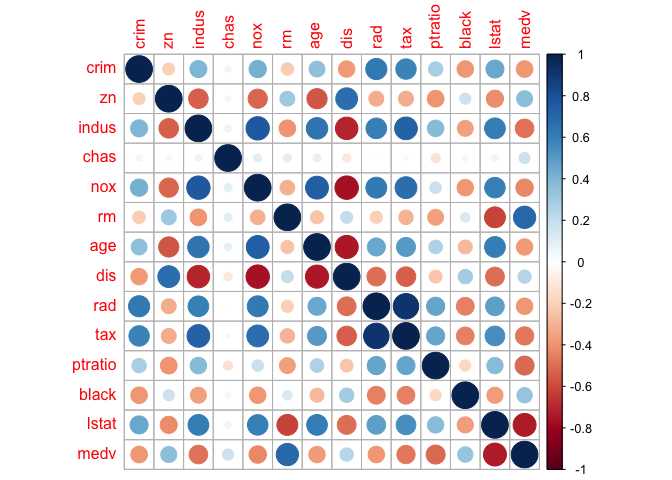<!-- -->

``` r
cor_plot
```

    ## $corr
    ##                crim          zn       indus         chas         nox
    ## crim     1.00000000 -0.20046922  0.40658341 -0.055891582  0.42097171
    ## zn      -0.20046922  1.00000000 -0.53382819 -0.042696719 -0.51660371
    ## indus    0.40658341 -0.53382819  1.00000000  0.062938027  0.76365145
    ## chas    -0.05589158 -0.04269672  0.06293803  1.000000000  0.09120281
    ## nox      0.42097171 -0.51660371  0.76365145  0.091202807  1.00000000
    ## rm      -0.21924670  0.31199059 -0.39167585  0.091251225 -0.30218819
    ## age      0.35273425 -0.56953734  0.64477851  0.086517774  0.73147010
    ## dis     -0.37967009  0.66440822 -0.70802699 -0.099175780 -0.76923011
    ## rad      0.62550515 -0.31194783  0.59512927 -0.007368241  0.61144056
    ## tax      0.58276431 -0.31456332  0.72076018 -0.035586518  0.66802320
    ## ptratio  0.28994558 -0.39167855  0.38324756 -0.121515174  0.18893268
    ## black   -0.38506394  0.17552032 -0.35697654  0.048788485 -0.38005064
    ## lstat    0.45562148 -0.41299457  0.60379972 -0.053929298  0.59087892
    ## medv    -0.38830461  0.36044534 -0.48372516  0.175260177 -0.42732077
    ##                  rm         age         dis          rad         tax    ptratio
    ## crim    -0.21924670  0.35273425 -0.37967009  0.625505145  0.58276431  0.2899456
    ## zn       0.31199059 -0.56953734  0.66440822 -0.311947826 -0.31456332 -0.3916785
    ## indus   -0.39167585  0.64477851 -0.70802699  0.595129275  0.72076018  0.3832476
    ## chas     0.09125123  0.08651777 -0.09917578 -0.007368241 -0.03558652 -0.1215152
    ## nox     -0.30218819  0.73147010 -0.76923011  0.611440563  0.66802320  0.1889327
    ## rm       1.00000000 -0.24026493  0.20524621 -0.209846668 -0.29204783 -0.3555015
    ## age     -0.24026493  1.00000000 -0.74788054  0.456022452  0.50645559  0.2615150
    ## dis      0.20524621 -0.74788054  1.00000000 -0.494587930 -0.53443158 -0.2324705
    ## rad     -0.20984667  0.45602245 -0.49458793  1.000000000  0.91022819  0.4647412
    ## tax     -0.29204783  0.50645559 -0.53443158  0.910228189  1.00000000  0.4608530
    ## ptratio -0.35550149  0.26151501 -0.23247054  0.464741179  0.46085304  1.0000000
    ## black    0.12806864 -0.27353398  0.29151167 -0.444412816 -0.44180801 -0.1773833
    ## lstat   -0.61380827  0.60233853 -0.49699583  0.488676335  0.54399341  0.3740443
    ## medv     0.69535995 -0.37695457  0.24992873 -0.381626231 -0.46853593 -0.5077867
    ##               black      lstat       medv
    ## crim    -0.38506394  0.4556215 -0.3883046
    ## zn       0.17552032 -0.4129946  0.3604453
    ## indus   -0.35697654  0.6037997 -0.4837252
    ## chas     0.04878848 -0.0539293  0.1752602
    ## nox     -0.38005064  0.5908789 -0.4273208
    ## rm       0.12806864 -0.6138083  0.6953599
    ## age     -0.27353398  0.6023385 -0.3769546
    ## dis      0.29151167 -0.4969958  0.2499287
    ## rad     -0.44441282  0.4886763 -0.3816262
    ## tax     -0.44180801  0.5439934 -0.4685359
    ## ptratio -0.17738330  0.3740443 -0.5077867
    ## black    1.00000000 -0.3660869  0.3334608
    ## lstat   -0.36608690  1.0000000 -0.7376627
    ## medv     0.33346082 -0.7376627  1.0000000
    ## 
    ## $corrPos
    ##       xName   yName  x  y         corr
    ## 1      crim    crim  1 14  1.000000000
    ## 2      crim      zn  1 13 -0.200469220
    ## 3      crim   indus  1 12  0.406583411
    ## 4      crim    chas  1 11 -0.055891582
    ## 5      crim     nox  1 10  0.420971711
    ## 6      crim      rm  1  9 -0.219246703
    ## 7      crim     age  1  8  0.352734251
    ## 8      crim     dis  1  7 -0.379670087
    ## 9      crim     rad  1  6  0.625505145
    ## 10     crim     tax  1  5  0.582764312
    ## 11     crim ptratio  1  4  0.289945579
    ## 12     crim   black  1  3 -0.385063942
    ## 13     crim   lstat  1  2  0.455621479
    ## 14     crim    medv  1  1 -0.388304609
    ## 15       zn    crim  2 14 -0.200469220
    ## 16       zn      zn  2 13  1.000000000
    ## 17       zn   indus  2 12 -0.533828186
    ## 18       zn    chas  2 11 -0.042696719
    ## 19       zn     nox  2 10 -0.516603708
    ## 20       zn      rm  2  9  0.311990587
    ## 21       zn     age  2  8 -0.569537342
    ## 22       zn     dis  2  7  0.664408223
    ## 23       zn     rad  2  6 -0.311947826
    ## 24       zn     tax  2  5 -0.314563325
    ## 25       zn ptratio  2  4 -0.391678548
    ## 26       zn   black  2  3  0.175520317
    ## 27       zn   lstat  2  2 -0.412994575
    ## 28       zn    medv  2  1  0.360445342
    ## 29    indus    crim  3 14  0.406583411
    ## 30    indus      zn  3 13 -0.533828186
    ## 31    indus   indus  3 12  1.000000000
    ## 32    indus    chas  3 11  0.062938027
    ## 33    indus     nox  3 10  0.763651447
    ## 34    indus      rm  3  9 -0.391675853
    ## 35    indus     age  3  8  0.644778511
    ## 36    indus     dis  3  7 -0.708026989
    ## 37    indus     rad  3  6  0.595129275
    ## 38    indus     tax  3  5  0.720760180
    ## 39    indus ptratio  3  4  0.383247556
    ## 40    indus   black  3  3 -0.356976535
    ## 41    indus   lstat  3  2  0.603799716
    ## 42    indus    medv  3  1 -0.483725160
    ## 43     chas    crim  4 14 -0.055891582
    ## 44     chas      zn  4 13 -0.042696719
    ## 45     chas   indus  4 12  0.062938027
    ## 46     chas    chas  4 11  1.000000000
    ## 47     chas     nox  4 10  0.091202807
    ## 48     chas      rm  4  9  0.091251225
    ## 49     chas     age  4  8  0.086517774
    ## 50     chas     dis  4  7 -0.099175780
    ## 51     chas     rad  4  6 -0.007368241
    ## 52     chas     tax  4  5 -0.035586518
    ## 53     chas ptratio  4  4 -0.121515174
    ## 54     chas   black  4  3  0.048788485
    ## 55     chas   lstat  4  2 -0.053929298
    ## 56     chas    medv  4  1  0.175260177
    ## 57      nox    crim  5 14  0.420971711
    ## 58      nox      zn  5 13 -0.516603708
    ## 59      nox   indus  5 12  0.763651447
    ## 60      nox    chas  5 11  0.091202807
    ## 61      nox     nox  5 10  1.000000000
    ## 62      nox      rm  5  9 -0.302188188
    ## 63      nox     age  5  8  0.731470104
    ## 64      nox     dis  5  7 -0.769230113
    ## 65      nox     rad  5  6  0.611440563
    ## 66      nox     tax  5  5  0.668023200
    ## 67      nox ptratio  5  4  0.188932677
    ## 68      nox   black  5  3 -0.380050638
    ## 69      nox   lstat  5  2  0.590878921
    ## 70      nox    medv  5  1 -0.427320772
    ## 71       rm    crim  6 14 -0.219246703
    ## 72       rm      zn  6 13  0.311990587
    ## 73       rm   indus  6 12 -0.391675853
    ## 74       rm    chas  6 11  0.091251225
    ## 75       rm     nox  6 10 -0.302188188
    ## 76       rm      rm  6  9  1.000000000
    ## 77       rm     age  6  8 -0.240264931
    ## 78       rm     dis  6  7  0.205246213
    ## 79       rm     rad  6  6 -0.209846668
    ## 80       rm     tax  6  5 -0.292047833
    ## 81       rm ptratio  6  4 -0.355501495
    ## 82       rm   black  6  3  0.128068635
    ## 83       rm   lstat  6  2 -0.613808272
    ## 84       rm    medv  6  1  0.695359947
    ## 85      age    crim  7 14  0.352734251
    ## 86      age      zn  7 13 -0.569537342
    ## 87      age   indus  7 12  0.644778511
    ## 88      age    chas  7 11  0.086517774
    ## 89      age     nox  7 10  0.731470104
    ## 90      age      rm  7  9 -0.240264931
    ## 91      age     age  7  8  1.000000000
    ## 92      age     dis  7  7 -0.747880541
    ## 93      age     rad  7  6  0.456022452
    ## 94      age     tax  7  5  0.506455594
    ## 95      age ptratio  7  4  0.261515012
    ## 96      age   black  7  3 -0.273533977
    ## 97      age   lstat  7  2  0.602338529
    ## 98      age    medv  7  1 -0.376954565
    ## 99      dis    crim  8 14 -0.379670087
    ## 100     dis      zn  8 13  0.664408223
    ## 101     dis   indus  8 12 -0.708026989
    ## 102     dis    chas  8 11 -0.099175780
    ## 103     dis     nox  8 10 -0.769230113
    ## 104     dis      rm  8  9  0.205246213
    ## 105     dis     age  8  8 -0.747880541
    ## 106     dis     dis  8  7  1.000000000
    ## 107     dis     rad  8  6 -0.494587930
    ## 108     dis     tax  8  5 -0.534431584
    ## 109     dis ptratio  8  4 -0.232470542
    ## 110     dis   black  8  3  0.291511673
    ## 111     dis   lstat  8  2 -0.496995831
    ## 112     dis    medv  8  1  0.249928734
    ## 113     rad    crim  9 14  0.625505145
    ## 114     rad      zn  9 13 -0.311947826
    ## 115     rad   indus  9 12  0.595129275
    ## 116     rad    chas  9 11 -0.007368241
    ## 117     rad     nox  9 10  0.611440563
    ## 118     rad      rm  9  9 -0.209846668
    ## 119     rad     age  9  8  0.456022452
    ## 120     rad     dis  9  7 -0.494587930
    ## 121     rad     rad  9  6  1.000000000
    ## 122     rad     tax  9  5  0.910228189
    ## 123     rad ptratio  9  4  0.464741179
    ## 124     rad   black  9  3 -0.444412816
    ## 125     rad   lstat  9  2  0.488676335
    ## 126     rad    medv  9  1 -0.381626231
    ## 127     tax    crim 10 14  0.582764312
    ## 128     tax      zn 10 13 -0.314563325
    ## 129     tax   indus 10 12  0.720760180
    ## 130     tax    chas 10 11 -0.035586518
    ## 131     tax     nox 10 10  0.668023200
    ## 132     tax      rm 10  9 -0.292047833
    ## 133     tax     age 10  8  0.506455594
    ## 134     tax     dis 10  7 -0.534431584
    ## 135     tax     rad 10  6  0.910228189
    ## 136     tax     tax 10  5  1.000000000
    ## 137     tax ptratio 10  4  0.460853035
    ## 138     tax   black 10  3 -0.441808007
    ## 139     tax   lstat 10  2  0.543993412
    ## 140     tax    medv 10  1 -0.468535934
    ## 141 ptratio    crim 11 14  0.289945579
    ## 142 ptratio      zn 11 13 -0.391678548
    ## 143 ptratio   indus 11 12  0.383247556
    ## 144 ptratio    chas 11 11 -0.121515174
    ## 145 ptratio     nox 11 10  0.188932677
    ## 146 ptratio      rm 11  9 -0.355501495
    ## 147 ptratio     age 11  8  0.261515012
    ## 148 ptratio     dis 11  7 -0.232470542
    ## 149 ptratio     rad 11  6  0.464741179
    ## 150 ptratio     tax 11  5  0.460853035
    ## 151 ptratio ptratio 11  4  1.000000000
    ## 152 ptratio   black 11  3 -0.177383302
    ## 153 ptratio   lstat 11  2  0.374044317
    ## 154 ptratio    medv 11  1 -0.507786686
    ## 155   black    crim 12 14 -0.385063942
    ## 156   black      zn 12 13  0.175520317
    ## 157   black   indus 12 12 -0.356976535
    ## 158   black    chas 12 11  0.048788485
    ## 159   black     nox 12 10 -0.380050638
    ## 160   black      rm 12  9  0.128068635
    ## 161   black     age 12  8 -0.273533977
    ## 162   black     dis 12  7  0.291511673
    ## 163   black     rad 12  6 -0.444412816
    ## 164   black     tax 12  5 -0.441808007
    ## 165   black ptratio 12  4 -0.177383302
    ## 166   black   black 12  3  1.000000000
    ## 167   black   lstat 12  2 -0.366086902
    ## 168   black    medv 12  1  0.333460820
    ## 169   lstat    crim 13 14  0.455621479
    ## 170   lstat      zn 13 13 -0.412994575
    ## 171   lstat   indus 13 12  0.603799716
    ## 172   lstat    chas 13 11 -0.053929298
    ## 173   lstat     nox 13 10  0.590878921
    ## 174   lstat      rm 13  9 -0.613808272
    ## 175   lstat     age 13  8  0.602338529
    ## 176   lstat     dis 13  7 -0.496995831
    ## 177   lstat     rad 13  6  0.488676335
    ## 178   lstat     tax 13  5  0.543993412
    ## 179   lstat ptratio 13  4  0.374044317
    ## 180   lstat   black 13  3 -0.366086902
    ## 181   lstat   lstat 13  2  1.000000000
    ## 182   lstat    medv 13  1 -0.737662726
    ## 183    medv    crim 14 14 -0.388304609
    ## 184    medv      zn 14 13  0.360445342
    ## 185    medv   indus 14 12 -0.483725160
    ## 186    medv    chas 14 11  0.175260177
    ## 187    medv     nox 14 10 -0.427320772
    ## 188    medv      rm 14  9  0.695359947
    ## 189    medv     age 14  8 -0.376954565
    ## 190    medv     dis 14  7  0.249928734
    ## 191    medv     rad 14  6 -0.381626231
    ## 192    medv     tax 14  5 -0.468535934
    ## 193    medv ptratio 14  4 -0.507786686
    ## 194    medv   black 14  3  0.333460820
    ## 195    medv   lstat 14  2 -0.737662726
    ## 196    medv    medv 14  1  1.000000000
    ## 
    ## $arg
    ## $arg$type
    ## [1] "full"

### Distribution of Data (‘medv’)

``` r
# Histogram
hist(Boston$medv, main = "Distribution of Median Home Values (medv)", xlab = "medv")
```

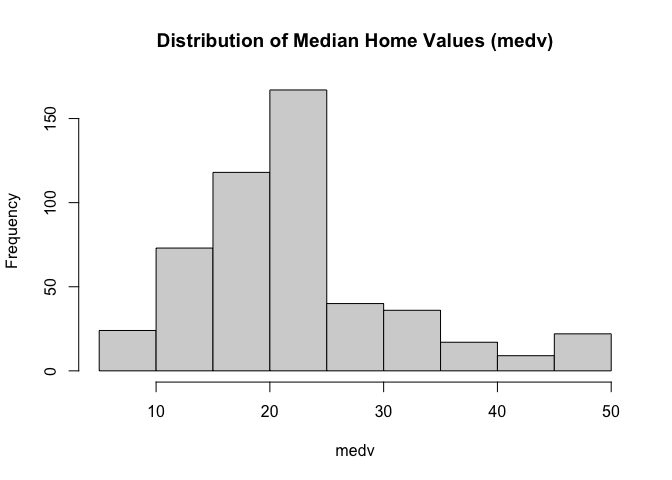<!-- -->

From the histogram above, we can see the data roughly follows a normal
distribution, with a positive skew. The most common ‘bin’ of median home
value is \$200,000 to \$250,000.

### Boxplots of ‘medv’ vs. Categorical Variables

#### ‘chas’

``` r
# Boxplot of 'medv' vs. 'chas'
boxplot(medv ~ chas, data = Boston, main = "medv vs. chas", xlab = "chas (z = tract bounds river, 0 = otherwise)")
```

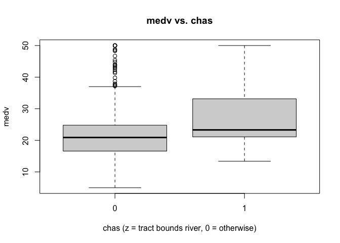<!-- -->

#### ‘rad’

``` r
# Boxplot of 'medv' vs. 'chas'
boxplot(medv ~ as.factor(rad), data = Boston, main = "medv vs. rad", xlab = "rad (index of accessibility to radial highways)")
```

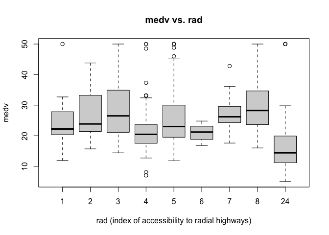<!-- -->

### Scatterplots of ‘medv’ vs. Continuous Variables

``` r
# Identify continuous variables
continuous_vars <- c("crim", "zn", "indus", "nox", "rm", "age", "dis", "tax", "ptratio", "black", "lstat")

# Create scatterplots for continuous variables
par(mfrow = c(4,3))
for (var in continuous_vars) {
  plot(Boston[[var]], Boston$medv, xlab = var, ylab = "medv", main = paste("medv vs.", var))
}
```

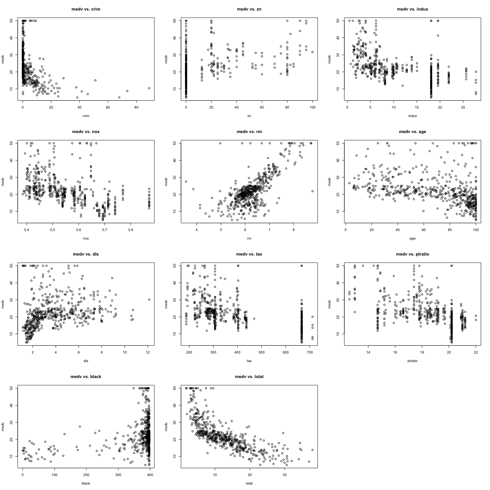<!-- -->

Above, there are some relationships that appear strong. Particularly,
the ‘rm’ and ‘lstat’ variables seem to have somewhat linear
relationships with the ‘medv’ variable. Here, ‘rm’ has a positive
relationship and ‘lstat’ has a negative relationship with the target
variable.

## Data Preparation

### Training and Testing Data Split

Below I will perform a 80%/20% training and testing data split using my
UC M# (12470675) as the seed for reproducibility.

``` r
set.seed(12470675)

sample_index <- sample(nrow(Boston),nrow(Boston)*0.80)
Boston_train <- Boston[sample_index,]
Boston_test <- Boston[-sample_index,]

n <- dim(Boston_train)[1] # sample size
p <- dim(Boston)[2]-1 # number of predictors excluding column of ones
```

## Model Creation and Evaluation

### 1. Linear Model

#### Full Linear Model

##### Model Creation

``` r
# Full Model
Boston.full.lm <- lm(medv ~ ., data = Boston_train)
summary(Boston.full.lm)
```

    ## 
    ## Call:
    ## lm(formula = medv ~ ., data = Boston_train)
    ## 
    ## Residuals:
    ##      Min       1Q   Median       3Q      Max 
    ## -15.9396  -2.6215  -0.5663   1.6203  24.5936 
    ## 
    ## Coefficients:
    ##               Estimate Std. Error t value Pr(>|t|)    
    ## (Intercept)  37.181823   5.643028   6.589 1.44e-10 ***
    ## crim         -0.082154   0.047949  -1.713 0.087439 .  
    ## zn            0.046544   0.015206   3.061 0.002360 ** 
    ## indus         0.055608   0.072621   0.766 0.444301    
    ## chas          3.270900   0.941602   3.474 0.000571 ***
    ## nox         -18.833509   4.385189  -4.295 2.21e-05 ***
    ## rm            3.465980   0.457537   7.575 2.63e-13 ***
    ## age           0.015072   0.015452   0.975 0.329946    
    ## dis          -1.397762   0.228223  -6.125 2.22e-09 ***
    ## rad           0.341886   0.077889   4.389 1.47e-05 ***
    ## tax          -0.015169   0.004393  -3.453 0.000616 ***
    ## ptratio      -0.842302   0.146235  -5.760 1.71e-08 ***
    ## black         0.009523   0.003116   3.056 0.002394 ** 
    ## lstat        -0.622804   0.058112 -10.717  < 2e-16 ***
    ## ---
    ## Signif. codes:  0 '***' 0.001 '**' 0.01 '*' 0.05 '.' 0.1 ' ' 1
    ## 
    ## Residual standard error: 4.764 on 390 degrees of freedom
    ## Multiple R-squared:  0.7439, Adjusted R-squared:  0.7354 
    ## F-statistic: 87.15 on 13 and 390 DF,  p-value: < 2.2e-16

##### Model Evaluation

``` r
# in-sample fit (prediction), full data available #
ASE_full_linear <- mean(Boston.full.lm$residuals^2)

# out-of-sample fit (prediction) MSPE for full LM model #
pred_full_linear_test <- predict(Boston.full.lm, Boston_test)
MSPE_full_linear <- mean((Boston_test$medv - pred_full_linear_test)^2)
```

**Full Linear Model Results:**

- ASE: 21.9136453
- MSPE: 23.4721289

#### Stepwise Variable Selection with AIC

##### Model Creation

``` r
lm_model_null <- lm(medv ~ 1, data = Boston_train)
model_step_aic <- step(
   lm_model_null,
   scope = list(lower = lm_model_null, upper = Boston.full.lm),
   k = 2,
   direction = "both")
```

    ## Start:  AIC=1799.56
    ## medv ~ 1
    ## 
    ##           Df Sum of Sq   RSS    AIC
    ## + lstat    1   19532.0 15041 1465.3
    ## + rm       1   15883.2 18690 1553.1
    ## + ptratio  1    8068.4 26504 1694.2
    ## + indus    1    7393.3 27180 1704.4
    ## + tax      1    7186.5 27386 1707.4
    ## + nox      1    5992.6 28580 1724.7
    ## + crim     1    5582.1 28991 1730.4
    ## + age      1    4484.3 30089 1745.4
    ## + rad      1    4419.3 30153 1746.3
    ## + black    1    4185.4 30387 1749.4
    ## + zn       1    4115.4 30457 1750.4
    ## + dis      1    1643.2 32930 1781.9
    ## + chas     1    1321.8 33251 1785.8
    ## <none>                 34573 1799.6
    ## 
    ## Step:  AIC=1465.31
    ## medv ~ lstat
    ## 
    ##           Df Sum of Sq   RSS    AIC
    ## + rm       1    2922.7 12118 1380.0
    ## + ptratio  1    1525.2 13516 1424.1
    ## + chas     1     856.3 14185 1443.6
    ## + dis      1     673.4 14367 1448.8
    ## + age      1     485.0 14556 1454.1
    ## + tax      1     147.2 14894 1463.3
    ## + black    1     123.1 14918 1464.0
    ## + zn       1      79.1 14962 1465.2
    ## <none>                 15041 1465.3
    ## + indus    1      34.0 15007 1466.4
    ## + crim     1      30.5 15010 1466.5
    ## + nox      1       6.4 15034 1467.1
    ## + rad      1       1.6 15039 1467.3
    ## - lstat    1   19532.0 34573 1799.6
    ## 
    ## Step:  AIC=1380.02
    ## medv ~ lstat + rm
    ## 
    ##           Df Sum of Sq   RSS    AIC
    ## + ptratio  1     998.9 11119 1347.3
    ## + chas     1     590.1 11528 1361.9
    ## + dis      1     366.7 11752 1369.6
    ## + black    1     320.7 11797 1371.2
    ## + tax      1     224.4 11894 1374.5
    ## + age      1     142.9 11975 1377.2
    ## + rad      1      62.4 12056 1379.9
    ## <none>                 12118 1380.0
    ## + crim     1      55.4 12063 1380.2
    ## + zn       1      25.2 12093 1381.2
    ## + indus    1      19.4 12099 1381.4
    ## + nox      1       2.4 12116 1381.9
    ## - rm       1    2922.7 15041 1465.3
    ## - lstat    1    6571.4 18690 1553.1
    ## 
    ## Step:  AIC=1347.27
    ## medv ~ lstat + rm + ptratio
    ## 
    ##           Df Sum of Sq   RSS    AIC
    ## + dis      1     499.5 10620 1330.7
    ## + chas     1     470.7 10649 1331.8
    ## + black    1     277.8 10842 1339.0
    ## + age      1     206.9 10912 1341.7
    ## <none>                 11119 1347.3
    ## + rad      1      22.1 11097 1348.5
    ## + tax      1      18.4 11101 1348.6
    ## + zn       1      18.2 11101 1348.6
    ## + indus    1       8.9 11110 1349.0
    ## + crim     1       4.9 11114 1349.1
    ## + nox      1       0.9 11118 1349.2
    ## - ptratio  1     998.9 12118 1380.0
    ## - rm       1    2396.4 13516 1424.1
    ## - lstat    1    5006.2 16125 1495.4
    ## 
    ## Step:  AIC=1330.7
    ## medv ~ lstat + rm + ptratio + dis
    ## 
    ##           Df Sum of Sq   RSS    AIC
    ## + nox      1     532.7 10087 1311.9
    ## + black    1     390.9 10229 1317.5
    ## + chas     1     339.8 10280 1319.6
    ## + tax      1     199.2 10420 1325.0
    ## + indus    1     185.3 10434 1325.6
    ## + zn       1     119.5 10500 1328.1
    ## + crim     1      57.6 10562 1330.5
    ## <none>                 10620 1330.7
    ## + rad      1      10.6 10609 1332.3
    ## + age      1       0.5 10619 1332.7
    ## - dis      1     499.5 11119 1347.3
    ## - ptratio  1    1131.7 11752 1369.6
    ## - rm       1    2051.1 12671 1400.0
    ## - lstat    1    5424.4 16044 1495.4
    ## 
    ## Step:  AIC=1311.91
    ## medv ~ lstat + rm + ptratio + dis + nox
    ## 
    ##           Df Sum of Sq     RSS    AIC
    ## + chas     1     408.8  9678.3 1297.2
    ## + black    1     248.5  9838.5 1303.8
    ## + zn       1     122.2  9964.9 1309.0
    ## + rad      1      58.0 10029.1 1311.6
    ## <none>                 10087.1 1311.9
    ## + age      1      23.9 10063.2 1313.0
    ## + crim     1      20.7 10066.3 1313.1
    ## + tax      1      12.9 10074.2 1313.4
    ## + indus    1      12.4 10074.7 1313.4
    ## - nox      1     532.7 10619.7 1330.7
    ## - dis      1    1031.3 11118.4 1349.2
    ## - ptratio  1    1236.2 11323.2 1356.6
    ## - rm       1    1984.4 12071.4 1382.5
    ## - lstat    1    3909.0 13996.1 1442.2
    ## 
    ## Step:  AIC=1297.2
    ## medv ~ lstat + rm + ptratio + dis + nox + chas
    ## 
    ##           Df Sum of Sq     RSS    AIC
    ## + black    1     202.0  9476.3 1290.7
    ## + zn       1     132.2  9546.1 1293.6
    ## + rad      1      64.0  9614.4 1296.5
    ## <none>                  9678.3 1297.2
    ## + indus    1      22.2  9656.1 1298.3
    ## + age      1      12.5  9665.8 1298.7
    ## + crim     1      10.4  9667.9 1298.8
    ## + tax      1       5.4  9672.9 1299.0
    ## - chas     1     408.8 10087.1 1311.9
    ## - nox      1     601.7 10280.0 1319.6
    ## - dis      1     949.8 10628.1 1333.0
    ## - ptratio  1    1093.6 10771.9 1338.5
    ## - rm       1    1867.6 11545.9 1366.5
    ## - lstat    1    3757.6 13435.9 1427.7
    ## 
    ## Step:  AIC=1290.67
    ## medv ~ lstat + rm + ptratio + dis + nox + chas + black
    ## 
    ##           Df Sum of Sq     RSS    AIC
    ## + zn       1     156.8  9319.5 1285.9
    ## + rad      1     140.7  9335.6 1286.6
    ## <none>                  9476.3 1290.7
    ## + indus    1      12.8  9463.5 1292.1
    ## + age      1       2.8  9473.6 1292.6
    ## + tax      1       0.7  9475.6 1292.7
    ## + crim     1       0.1  9476.2 1292.7
    ## - black    1     202.0  9678.3 1297.2
    ## - chas     1     362.2  9838.5 1303.8
    ## - nox      1     456.3  9932.6 1307.7
    ## - dis      1     922.6 10398.9 1326.2
    ## - ptratio  1    1061.9 10538.2 1331.6
    ## - rm       1    1991.5 11467.8 1365.7
    ## - lstat    1    3188.0 12664.3 1405.8
    ## 
    ## Step:  AIC=1285.93
    ## medv ~ lstat + rm + ptratio + dis + nox + chas + black + zn
    ## 
    ##           Df Sum of Sq     RSS    AIC
    ## + rad      1      92.8  9226.7 1283.9
    ## <none>                  9319.5 1285.9
    ## + indus    1      13.5  9306.0 1287.3
    ## + age      1      11.6  9307.9 1287.4
    ## + tax      1       5.6  9313.9 1287.7
    ## + crim     1       4.2  9315.4 1287.8
    ## - zn       1     156.8  9476.3 1290.7
    ## - black    1     226.5  9546.1 1293.6
    ## - chas     1     370.0  9689.5 1299.7
    ## - nox      1     452.8  9772.3 1303.1
    ## - ptratio  1     760.8 10080.3 1315.6
    ## - dis      1    1071.0 10390.5 1327.9
    ## - rm       1    1813.5 11133.0 1355.8
    ## - lstat    1    3200.1 12519.7 1403.2
    ## 
    ## Step:  AIC=1283.89
    ## medv ~ lstat + rm + ptratio + dis + nox + chas + black + zn + 
    ##     rad
    ## 
    ##           Df Sum of Sq     RSS    AIC
    ## + tax      1     266.9  8959.8 1274.0
    ## + crim     1      58.0  9168.7 1283.3
    ## <none>                  9226.7 1283.9
    ## + indus    1      22.4  9204.3 1284.9
    ## + age      1      18.1  9208.5 1285.1
    ## - rad      1      92.8  9319.5 1285.9
    ## - zn       1     108.9  9335.6 1286.6
    ## - black    1     286.0  9512.6 1294.2
    ## - chas     1     368.5  9595.2 1297.7
    ## - nox      1     545.6  9772.3 1305.1
    ## - ptratio  1     833.2 10059.9 1316.8
    ## - dis      1    1032.0 10258.7 1324.7
    ## - rm       1    1677.1 10903.8 1349.4
    ## - lstat    1    3253.8 12480.5 1403.9
    ## 
    ## Step:  AIC=1274.03
    ## medv ~ lstat + rm + ptratio + dis + nox + chas + black + zn + 
    ##     rad + tax
    ## 
    ##           Df Sum of Sq     RSS    AIC
    ## + crim     1     71.34  8888.4 1272.8
    ## <none>                  8959.8 1274.0
    ## + age      1     24.09  8935.7 1274.9
    ## + indus    1     16.48  8943.3 1275.3
    ## - zn       1    167.37  9127.2 1279.5
    ## - tax      1    266.88  9226.7 1283.9
    ## - black    1    267.36  9227.1 1283.9
    ## - chas     1    320.42  9280.2 1286.2
    ## - rad      1    354.14  9313.9 1287.7
    ## - nox      1    355.95  9315.7 1287.8
    ## - ptratio  1    711.09  9670.9 1302.9
    ## - dis      1   1117.44 10077.2 1319.5
    ## - rm       1   1487.26 10447.0 1334.1
    ## - lstat    1   3136.23 12096.0 1393.3
    ## 
    ## Step:  AIC=1272.8
    ## medv ~ lstat + rm + ptratio + dis + nox + chas + black + zn + 
    ##     rad + tax + crim
    ## 
    ##           Df Sum of Sq     RSS    AIC
    ## <none>                  8888.4 1272.8
    ## + age      1     22.03  8866.4 1273.8
    ## - crim     1     71.34  8959.8 1274.0
    ## + indus    1     13.74  8874.7 1274.2
    ## - zn       1    191.16  9079.6 1279.4
    ## - black    1    222.98  9111.4 1280.8
    ## - tax      1    280.21  9168.7 1283.3
    ## - chas     1    302.20  9190.7 1284.3
    ## - nox      1    388.03  9276.5 1288.1
    ## - rad      1    423.82  9312.3 1289.6
    ## - ptratio  1    731.94  9620.4 1302.8
    ## - dis      1   1181.25 10069.7 1321.2
    ## - rm       1   1408.23 10296.7 1330.2
    ## - lstat    1   2850.26 11738.7 1383.2

``` r
model_step_aic
```

    ## 
    ## Call:
    ## lm(formula = medv ~ lstat + rm + ptratio + dis + nox + chas + 
    ##     black + zn + rad + tax + crim, data = Boston_train)
    ## 
    ## Coefficients:
    ## (Intercept)        lstat           rm      ptratio          dis          nox  
    ##   36.536739    -0.597600     3.526654    -0.820468    -1.510276   -16.876452  
    ##        chas        black           zn          rad          tax         crim  
    ##    3.406978     0.009707     0.043587     0.317333    -0.013337    -0.084897

``` r
summary(model_step_aic)
```

    ## 
    ## Call:
    ## lm(formula = medv ~ lstat + rm + ptratio + dis + nox + chas + 
    ##     black + zn + rad + tax + crim, data = Boston_train)
    ## 
    ## Residuals:
    ##      Min       1Q   Median       3Q      Max 
    ## -16.1595  -2.6561  -0.7108   1.7077  25.1558 
    ## 
    ## Coefficients:
    ##               Estimate Std. Error t value Pr(>|t|)    
    ## (Intercept)  36.536739   5.609373   6.514 2.25e-10 ***
    ## lstat        -0.597600   0.053301 -11.212  < 2e-16 ***
    ## rm            3.526654   0.447502   7.881 3.25e-14 ***
    ## ptratio      -0.820468   0.144409  -5.682 2.61e-08 ***
    ## dis          -1.510276   0.209245  -7.218 2.76e-12 ***
    ## nox         -16.876452   4.079595  -4.137 4.31e-05 ***
    ## chas          3.406978   0.933234   3.651 0.000297 ***
    ## black         0.009707   0.003096   3.136 0.001842 ** 
    ## zn            0.043587   0.015012   2.904 0.003898 ** 
    ## rad           0.317333   0.073400   4.323 1.95e-05 ***
    ## tax          -0.013337   0.003794  -3.515 0.000491 ***
    ## crim         -0.084897   0.047864  -1.774 0.076886 .  
    ## ---
    ## Signif. codes:  0 '***' 0.001 '**' 0.01 '*' 0.05 '.' 0.1 ' ' 1
    ## 
    ## Residual standard error: 4.762 on 392 degrees of freedom
    ## Multiple R-squared:  0.7429, Adjusted R-squared:  0.7357 
    ## F-statistic:   103 on 11 and 392 DF,  p-value: < 2.2e-16

##### Model Evaluation

``` r
# in-sample fit (prediction)
ASE_step_AIC <- mean(model_step_aic$residuals^2)

# out-of-sample fit (prediction) MSPE for full LM model #
pred_step_AIC <- predict(model_step_aic, Boston_test)
MSPE_step_AIC <- mean((Boston_test$medv - pred_step_AIC)^2)
```

**Stepwise Variable Selection with AIC Model Results:**

- ASE: 22.0011133
- MSPE: 22.7308494

### 2. Regression Tree

#### Original Regression Tree

##### Model Creation

``` r
boston_rpart <- rpart(formula = medv ~ ., data = Boston_train)
boston_rpart
```

    ## n= 404 
    ## 
    ## node), split, n, deviance, yval
    ##       * denotes terminal node
    ## 
    ##  1) root 404 34572.7900 22.69332  
    ##    2) rm< 6.8375 335 13509.0200 19.81224  
    ##      4) lstat>=14.4 133  2178.6410 14.69173  
    ##        8) dis< 1.92035 52   555.7452 11.64038 *
    ##        9) dis>=1.92035 81   827.9225 16.65062 *
    ##      5) lstat< 14.4 202  5547.1360 23.18366  
    ##       10) dis>=1.6009 195  2544.1640 22.69436  
    ##         20) rm< 6.543 160  1306.4570 21.71437 *
    ##         21) rm>=6.543 35   381.6069 27.17429 *
    ##       11) dis< 1.6009 7  1655.7290 36.81429 *
    ##    3) rm>=6.8375 69  4782.5460 36.68116  
    ##      6) rm< 7.437 44  1448.6250 32.28182  
    ##       12) lstat>=5.515 24   676.1250 29.57500 *
    ##       13) lstat< 5.515 20   385.6420 35.53000 *
    ##      7) rm>=7.437 25   983.5456 44.42400 *

``` r
 prp(boston_rpart,digits = 4, extra = 1)
```

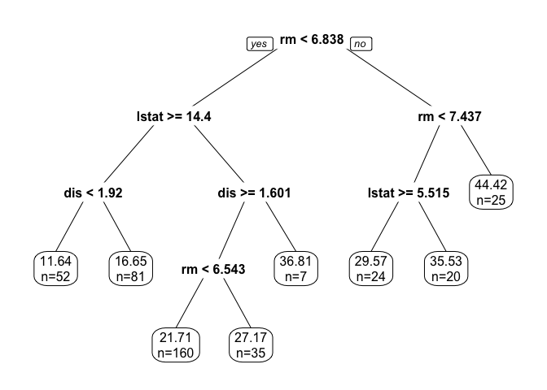<!-- -->

##### Model Evaluation

``` r
#in-sample prediction
boston_train_pred_tree = predict(boston_rpart, Boston_train)

#calculate the squared residuals
sq_residuals_tree <- (Boston_train$medv - boston_train_pred_tree)^2

#calculate ASE
ASE_regression_tree <- mean(sq_residuals_tree)

#out-of-sample prediction 
boston_test_pred_tree = predict(boston_rpart,Boston_test)
MSPE_regression_tree <- mean((Boston_test$medv - boston_test_pred_tree)^2)
```

**Original Regression Tree Results:**

- ASE: 16.7642887
- MSPE: 21.8385347

#### Pruned Regression Tree

##### Model Creation

``` r
boston_largetree <- rpart(formula = medv ~ ., data = Boston_train, cp = 0.001)

plotcp(boston_largetree)
```

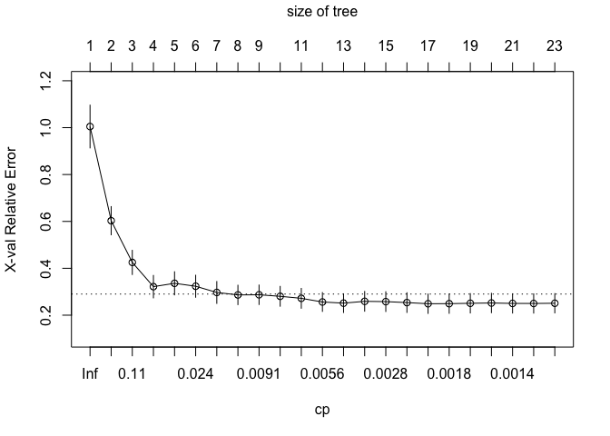<!-- -->

``` r
printcp(boston_largetree)
```

    ## 
    ## Regression tree:
    ## rpart(formula = medv ~ ., data = Boston_train, cp = 0.001)
    ## 
    ## Variables actually used in tree construction:
    ##  [1] age     black   crim    dis     lstat   nox     ptratio rad     rm     
    ## [10] tax     zn     
    ## 
    ## Root node error: 34573/404 = 85.576
    ## 
    ## n= 404 
    ## 
    ##           CP nsplit rel error  xerror     xstd
    ## 1  0.4709260      0   1.00000 1.00474 0.091200
    ## 2  0.1672773      1   0.52907 0.60310 0.060112
    ## 3  0.0679834      2   0.36180 0.42510 0.051640
    ## 4  0.0389683      3   0.29381 0.32170 0.047843
    ## 5  0.0247622      4   0.25485 0.33591 0.049337
    ## 6  0.0229942      5   0.23008 0.32342 0.046948
    ## 7  0.0111897      6   0.20709 0.29690 0.046640
    ## 8  0.0096089      7   0.19590 0.28637 0.041385
    ## 9  0.0086255      8   0.18629 0.28702 0.041487
    ## 10 0.0080935      9   0.17766 0.28047 0.042316
    ## 11 0.0065956     10   0.16957 0.27192 0.042385
    ## 12 0.0047170     11   0.16298 0.25626 0.040147
    ## 13 0.0034662     12   0.15826 0.25132 0.039965
    ## 14 0.0033310     13   0.15479 0.25904 0.042161
    ## 15 0.0024317     14   0.15146 0.25779 0.042147
    ## 16 0.0022426     15   0.14903 0.25368 0.042043
    ## 17 0.0019186     16   0.14679 0.24882 0.041281
    ## 18 0.0016136     17   0.14487 0.24916 0.041261
    ## 19 0.0015932     18   0.14325 0.25073 0.041301
    ## 20 0.0014894     19   0.14166 0.25196 0.041289
    ## 21 0.0013622     20   0.14017 0.25017 0.041143
    ## 22 0.0011861     21   0.13881 0.25000 0.041147
    ## 23 0.0010000     22   0.13762 0.25088 0.041161

``` r
boston_rpart_prune = prune(boston_largetree, cp = 0.0080935)
```

##### Model Evaluation

``` r
#in-sample prediction
boston_train_pred_tree_prune = predict(boston_rpart_prune, Boston_train)

#calculate the squared residuals
sq_residuals_tree_prune <- (Boston_train$medv - boston_train_pred_tree_prune)^2

#calculate ASE
ASE_regression_tree_prune <- mean(sq_residuals_tree_prune)

#out-of-sample prediction 
boston_test_pred_tree_prune = predict(boston_rpart_prune,Boston_test)
MSPE_regression_tree_prune <- mean((Boston_test$medv - boston_test_pred_tree_prune)^2)
```

**Pruned Regression Tree Results:**

- ASE: 14.5112512
- MSPE: 19.5134464

### 3. k-NN with optimal k

#### k-NN with optimal k *(scaled X)*

##### Normalization

``` r
train.norm <- Boston_train
test.norm <- Boston_test

## normalize numerical predictors to 0-1 scale
## for testing and training dataset 
## range [0,1]-standardization ##
cols <- colnames(train.norm[, -14]) #scaling only on p=13 predictors X
for (j in cols) {
  train.norm[[j]] <- (train.norm[[j]] - min(Boston_train[[j]])) / (max(Boston_train[[j]]) - min(Boston_train[[j]]))
  test.norm[[j]] <- (test.norm[[j]] - min(Boston_train[[j]])) / (max(Boston_train[[j]]) - min(Boston_train[[j]]))
}
```

##### Select the Best k

``` r
set.seed(12470675)
sample_index2 <- sample(nrow(Boston_train),nrow(Boston_train)*0.80)
train2.norm <- train.norm[sample_index2,]
valid.norm <- train.norm[-sample_index2,]

# initialize a data frame with two columns: k and accuracy
RMSE.df <- data.frame(k = seq(1, 30, 1), RMSE.k = rep(0, 30))

# compute knn for different k on validation set
for (i in 1:30) {
  knn.reg.pred <- knn.reg(train = train2.norm[, c(1:13)], test = valid.norm[, c(1:13)], 
                          y = train2.norm$medv, k = i)
  RMSE.df[i, 2] <- sqrt(sum((valid.norm$medv-knn.reg.pred$pred)^2)/length(valid.norm$medv))
}
RMSE.df
```

    ##     k   RMSE.k
    ## 1   1 5.621904
    ## 2   2 5.537119
    ## 3   3 5.223227
    ## 4   4 5.300772
    ## 5   5 5.427121
    ## 6   6 5.468343
    ## 7   7 5.539438
    ## 8   8 5.556274
    ## 9   9 5.343947
    ## 10 10 5.477418
    ## 11 11 5.480726
    ## 12 12 5.587456
    ## 13 13 5.619223
    ## 14 14 5.612212
    ## 15 15 5.685741
    ## 16 16 5.665460
    ## 17 17 5.614732
    ## 18 18 5.643805
    ## 19 19 5.663387
    ## 20 20 5.696054
    ## 21 21 5.687670
    ## 22 22 5.702366
    ## 23 23 5.681175
    ## 24 24 5.743257
    ## 25 25 5.755212
    ## 26 26 5.766532
    ## 27 27 5.791813
    ## 28 28 5.820042
    ## 29 29 5.871799
    ## 30 30 5.888626

``` r
k <- which(RMSE.df[,2] == min(RMSE.df[,2]))
k
```

    ## [1] 3

I will now proceed with knn using k=3.

##### Model Creation

``` r
Boston.knn.train.best.k <- knn.reg(train = train.norm[, 1:13],
                            test = train.norm[, 1:13],
                            y = train.norm$medv,
                            k = k)
Boston.knn.best.k <- data.frame(cbind(pred = Boston.knn.train.best.k$pred, actual=train.norm$medv))
```

##### Model Evaluation

``` r
#calculate in-sample ASE 
ASE_knn_best_k <- sum((Boston_train$medv-Boston.knn.best.k$pred)^2)/length(Boston_train$medv)


# Out-of-Sample Testing
Boston.knn.reg <- knn.reg(train = train.norm[, 1:13], 
                          test = test.norm[, 1:13], 
                          y = train.norm$medv, 
                          k = k)

Boston.knn.results <- data.frame(cbind(pred = Boston.knn.reg$pred, actual = Boston_test$medv))

# calculate MSPE (root mean (average) sum squared prediction errors)
MSPE_knn_best_k <- sum((Boston_test$medv-Boston.knn.results$pred)^2)/length(Boston_test$medv)
```

**k-NN Model Results:**

- ASE: 9.4693399
- MSPE: 14.4688998

### 4. Random Forests

#### Random Forests

##### Model Creation

``` r
Boston_rf <- randomForest(medv~., 
                          data = Boston_train, importance = TRUE)
summary(Boston_rf)
```

    ##                 Length Class  Mode     
    ## call              4    -none- call     
    ## type              1    -none- character
    ## predicted       404    -none- numeric  
    ## mse             500    -none- numeric  
    ## rsq             500    -none- numeric  
    ## oob.times       404    -none- numeric  
    ## importance       26    -none- numeric  
    ## importanceSD     13    -none- numeric  
    ## localImportance   0    -none- NULL     
    ## proximity         0    -none- NULL     
    ## ntree             1    -none- numeric  
    ## mtry              1    -none- numeric  
    ## forest           11    -none- list     
    ## coefs             0    -none- NULL     
    ## y               404    -none- numeric  
    ## test              0    -none- NULL     
    ## inbag             0    -none- NULL     
    ## terms             3    terms  call

##### Model Evaluation

``` r
# prediction on training sample
Boston_rf_pred_train <- predict(Boston_rf, Boston_train)
# in-sample ASE
ASE_random_forest <- mean((Boston_train$medv-Boston_rf_pred_train)^2) 

# plot out of bag (OOB) errors for each ntree value from 1 to 500
plot(Boston_rf$mse, type='l', col=2, lwd=2, xlab = "ntree", ylab = "OOB Error")
```

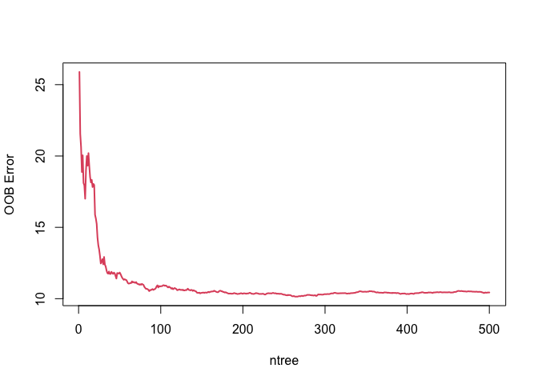<!-- -->

``` r
# prediction on testing sample
Boston_rf_pred_test <- predict(Boston_rf, Boston_test)
# out-of-sample MSPE
MSPE_random_forest <- mean((Boston_test$medv-Boston_rf_pred_test)^2) 
```

**Random Forest Model Results:**

- ASE: 2.0348652
- MSPE: 9.7253342

``` r
# make dataframe from importance() output
feat_imp_df <- importance(Boston_rf) %>% 
  data.frame() %>% 
  mutate(feature = row.names(.)) 
feat_imp_df
```

    ##          X.IncMSE IncNodePurity feature
    ## crim    12.860544     2016.1703    crim
    ## zn       3.600826      282.7530      zn
    ## indus   11.945734     1833.4535   indus
    ## chas     3.254583      226.8842    chas
    ## nox     14.747549     1938.0660     nox
    ## rm      33.558932     9695.3299      rm
    ## age      9.884350      870.5076     age
    ## dis     16.850483     2175.4557     dis
    ## rad      6.271453      275.9496     rad
    ## tax     12.798919     1347.8094     tax
    ## ptratio 15.568195     2010.3849 ptratio
    ## black    8.149253      630.6317   black
    ## lstat   30.419021    10689.2994   lstat

``` r
  # plot dataframe
ggplot(feat_imp_df, aes(x = reorder(feature, X.IncMSE), 
                         y = X.IncMSE)) +
    geom_bar(stat='identity') +
    coord_flip() +
    theme_classic() +
    labs(
      x     = "Feature",
      y     = "Importance",
      title = "Feature Importance: Random Forest Model"
    )
```

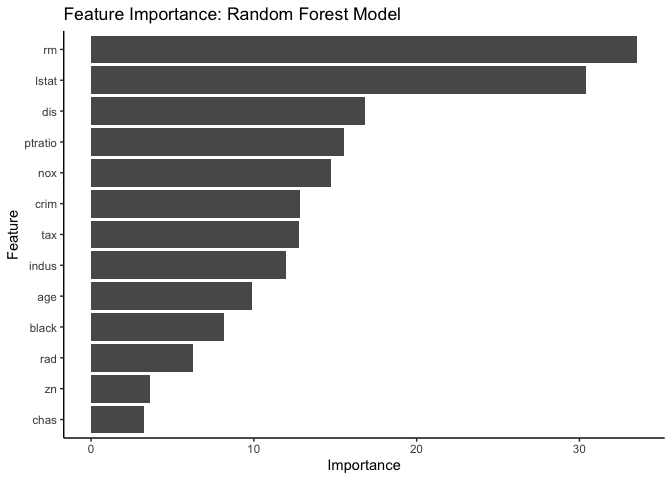<!-- -->

### 5. Boosting

#### Boosting

##### Model Creation

``` r
Boston_boost <- gbm(formula = medv~., 
                    data = Boston_train, 
                    distribution = "gaussian", n.trees=500)
summary(Boston_boost)
```

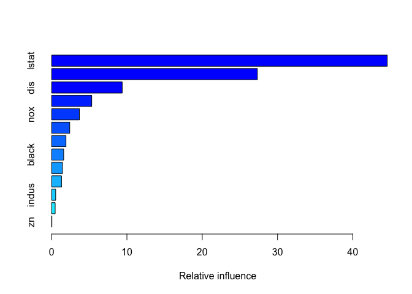<!-- -->

    ##             var     rel.inf
    ## lstat     lstat 44.57254169
    ## rm           rm 27.32190164
    ## dis         dis  9.37157973
    ## crim       crim  5.32804699
    ## nox         nox  3.68903169
    ## ptratio ptratio  2.40416779
    ## chas       chas  1.90724054
    ## black     black  1.60113862
    ## age         age  1.44095203
    ## tax         tax  1.31516866
    ## indus     indus  0.53919314
    ## rad         rad  0.47272127
    ## zn           zn  0.03631621

##### Model Evaluation

``` r
# in-sample prediction
Boston_boost_pred_train<- predict(Boston_boost, Boston_train, n.trees=500) 
# in-sample ASE
ASE_boosting <- mean((Boston_train$medv-Boston_boost_pred_train)^2) 

# out-of-sample prediction 
Boston_boost_pred_test<- predict(Boston_boost, Boston_test, n.trees=500)
# out-of-sample MSPE
MSPE_boosting <- mean((Boston_test$medv-Boston_boost_pred_test)^2) 
```

**Boosting Model Results:**

- ASE: 7.0525458
- MSPE: 14.2900702

### 6. GAM

#### Generalized Additive Model (GAM)

##### Model Creation

``` r
Boston_gam <- gam(medv ~ s(crim)+s(zn)+s(indus)+chas+s(nox)
                  +s(rm)+s(age)+s(dis)+rad+s(tax)+s(ptratio)
                  +s(black)+s(lstat),data=Boston_train)
summary(Boston_gam)
```

    ## 
    ## Family: gaussian 
    ## Link function: identity 
    ## 
    ## Formula:
    ## medv ~ s(crim) + s(zn) + s(indus) + chas + s(nox) + s(rm) + s(age) + 
    ##     s(dis) + rad + s(tax) + s(ptratio) + s(black) + s(lstat)
    ## 
    ## Parametric coefficients:
    ##             Estimate Std. Error t value Pr(>|t|)    
    ## (Intercept)  18.1806     1.2017  15.129  < 2e-16 ***
    ## chas          1.2160     0.6488   1.874 0.061730 .  
    ## rad           0.4605     0.1240   3.713 0.000238 ***
    ## ---
    ## Signif. codes:  0 '***' 0.001 '**' 0.01 '*' 0.05 '.' 0.1 ' ' 1
    ## 
    ## Approximate significance of smooth terms:
    ##              edf Ref.df      F  p-value    
    ## s(crim)    5.916  7.012  8.693  < 2e-16 ***
    ## s(zn)      1.000  1.000  0.034 0.853602    
    ## s(indus)   7.422  8.295  3.352 0.000912 ***
    ## s(nox)     8.929  8.993 14.465  < 2e-16 ***
    ## s(rm)      8.382  8.879 19.995  < 2e-16 ***
    ## s(age)     1.000  1.000  0.159 0.690632    
    ## s(dis)     8.807  8.983  8.010  < 2e-16 ***
    ## s(tax)     3.236  3.906  9.922 5.72e-07 ***
    ## s(ptratio) 1.440  1.755 16.612 3.51e-06 ***
    ## s(black)   1.872  2.314  2.387 0.073678 .  
    ## s(lstat)   6.159  7.348 25.397  < 2e-16 ***
    ## ---
    ## Signif. codes:  0 '***' 0.001 '**' 0.01 '*' 0.05 '.' 0.1 ' ' 1
    ## 
    ## R-sq.(adj) =  0.898   Deviance explained = 91.2%
    ## GCV = 10.166  Scale est. = 8.7276    n = 404

``` r
plot(Boston_gam, shade=TRUE, seWithMean=TRUE, scale=0, pages=1)
```

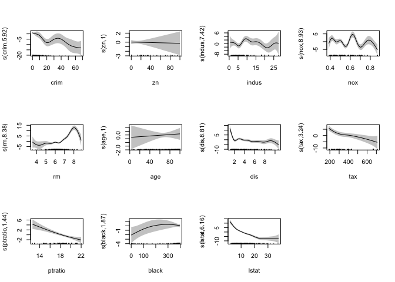<!-- -->
\###### Refit GAM Model

``` r
#refit  gam on Boston training (nonlinear to linear)

Boston_gam_re <- gam(medv ~ s(crim)+zn+s(indus)+chas+s(nox)
                     +s(rm)+age+s(dis)+rad+s(tax)+ptratio
                     +s(black)+s(lstat),data=Boston_train)
summary(Boston_gam_re)
```

    ## 
    ## Family: gaussian 
    ## Link function: identity 
    ## 
    ## Formula:
    ## medv ~ s(crim) + zn + s(indus) + chas + s(nox) + s(rm) + age + 
    ##     s(dis) + rad + s(tax) + ptratio + s(black) + s(lstat)
    ## 
    ## Parametric coefficients:
    ##              Estimate Std. Error t value Pr(>|t|)    
    ## (Intercept) 30.211217   2.848995  10.604  < 2e-16 ***
    ## zn          -0.002212   0.014530  -0.152 0.879099    
    ## chas         1.233321   0.649491   1.899 0.058406 .  
    ## age          0.004472   0.011862   0.377 0.706402    
    ## rad          0.451044   0.123098   3.664 0.000287 ***
    ## ptratio     -0.663635   0.127633  -5.200 3.42e-07 ***
    ## ---
    ## Signif. codes:  0 '***' 0.001 '**' 0.01 '*' 0.05 '.' 0.1 ' ' 1
    ## 
    ## Approximate significance of smooth terms:
    ##            edf Ref.df      F  p-value    
    ## s(crim)  5.858  6.955  8.707  < 2e-16 ***
    ## s(indus) 7.603  8.434  3.472 0.000595 ***
    ## s(nox)   8.968  8.997 14.634  < 2e-16 ***
    ## s(rm)    8.412  8.889 20.584  < 2e-16 ***
    ## s(dis)   8.776  8.980  7.890  < 2e-16 ***
    ## s(tax)   3.077  3.730 10.173 6.06e-07 ***
    ## s(black) 1.904  2.353  2.479 0.065031 .  
    ## s(lstat) 6.146  7.337 25.227  < 2e-16 ***
    ## ---
    ## Signif. codes:  0 '***' 0.001 '**' 0.01 '*' 0.05 '.' 0.1 ' ' 1
    ## 
    ## R-sq.(adj) =  0.898   Deviance explained = 91.2%
    ## GCV = 10.172  Scale est. = 8.7433    n = 404

``` r
plot(Boston_gam_re, shade=TRUE, seWithMean=TRUE, scale=0, pages=1)
```

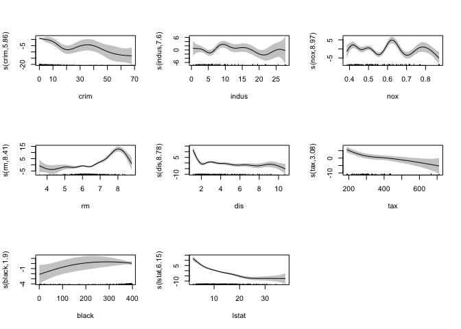<!-- -->

###### Refit GAM Model and Remove Insignificant Variables

``` r
#refit  gam on Boston training (remove nonsignificant variables)

Boston_gam_final <- gam(medv ~ s(crim)+s(indus)+s(nox)
                        +s(rm)+s(dis)+rad+s(tax)+ptratio
                        +s(lstat),data=Boston_train)
summary(Boston_gam_final)
```

    ## 
    ## Family: gaussian 
    ## Link function: identity 
    ## 
    ## Formula:
    ## medv ~ s(crim) + s(indus) + s(nox) + s(rm) + s(dis) + rad + s(tax) + 
    ##     ptratio + s(lstat)
    ## 
    ## Parametric coefficients:
    ##             Estimate Std. Error t value Pr(>|t|)    
    ## (Intercept)  31.5527     2.6804  11.772  < 2e-16 ***
    ## rad           0.4359     0.1218   3.579 0.000393 ***
    ## ptratio      -0.7083     0.1240  -5.713 2.36e-08 ***
    ## ---
    ## Signif. codes:  0 '***' 0.001 '**' 0.01 '*' 0.05 '.' 0.1 ' ' 1
    ## 
    ## Approximate significance of smooth terms:
    ##            edf Ref.df     F p-value    
    ## s(crim)  6.107  7.206 10.04 < 2e-16 ***
    ## s(indus) 7.232  8.163  3.22 0.00142 ** 
    ## s(nox)   8.960  8.996 15.25 < 2e-16 ***
    ## s(rm)    8.256  8.834 21.53 < 2e-16 ***
    ## s(dis)   8.820  8.986 11.27 < 2e-16 ***
    ## s(tax)   3.303  3.994 10.37 < 2e-16 ***
    ## s(lstat) 6.122  7.311 33.33 < 2e-16 ***
    ## ---
    ## Signif. codes:  0 '***' 0.001 '**' 0.01 '*' 0.05 '.' 0.1 ' ' 1
    ## 
    ## R-sq.(adj) =  0.896   Deviance explained = 90.9%
    ## GCV = 10.203  Scale est. = 8.8947    n = 404

``` r
plot(Boston_gam_final, shade=TRUE, seWithMean=TRUE, scale=0, pages=1)
```

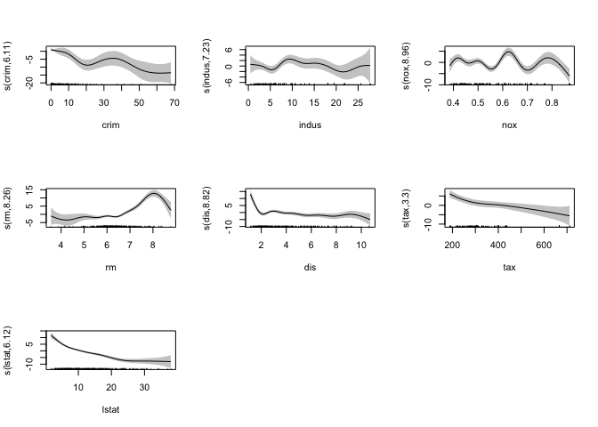<!-- -->

##### Model Evaluation

``` r
# in-sample ASE
ASE_gam.orig <- Boston_gam$dev/nrow(Boston_train) #original model
ASE_gam.re <- Boston_gam_re$dev/nrow(Boston_train) #adjusted model
ASE_gam.final <- Boston_gam_final$dev/nrow(Boston_train) #final model

#out of sample MSPE
pred_gam_orig_test <- predict(Boston_gam,Boston_test)#final model
MSPE_gam.orig <- mean((pred_gam_orig_test - Boston_test$medv)^2)

pred_gam_re_test <- predict(Boston_gam_re, Boston_test)#final model
MSPE_gam.re <- mean((pred_gam_re_test - Boston_test$medv)^2)

pred_gam_final_test <- predict(Boston_gam_final,Boston_test)
MSPE_gam.final <- mean((pred_gam_final_test - Boston_test$medv)^2)
```

**GAM Model Results:**

**Original GAM Model**

- ASE: 7.4927448
- MSPE: 17.0712952

**Adjusted GAM Model (nonlinear to linear)**

- ASE: 7.5152732
- MSPE: 17.0894678

**Final GAM Model (remove insignificant variables)**

- ASE: 7.7542537
- MSPE: 16.2152644

### 7. Neural Networks

#### Neural Networks *(scaled X&Y)*

##### Scale X and Y

``` r
## initialize scaling training, testing, and new data frames to originals ##
train.norm <- Boston_train
test.norm <- Boston_test


## normalize all numerical variables (X&Y) to 0-1 scale, range [0,1]-standardization ##
cols <- colnames(train.norm[, ]) #scaling both X and Y
for (j in cols) {
  train.norm[[j]] <- (train.norm[[j]] - min(Boston_train[[j]])) / (max(Boston_train[[j]]) - min(Boston_train[[j]]))
  test.norm[[j]] <- (test.norm[[j]] - min(Boston_train[[j]])) / (max(Boston_train[[j]]) - min(Boston_train[[j]]))
}
```

##### Model Creation

``` r
#### Neural networks on (scaled) Training data and plot ####
set.seed(12470675)
f <- as.formula("medv ~ .")
Boston_nn_scaled <- neuralnet(f,data=train.norm, hidden=c(5,3), linear.output=T)
plot(Boston_nn_scaled)
```

##### Model Evaluation

``` r
# in-sample prediction
pr_nn_scaled_train <- compute(Boston_nn_scaled, train.norm[,1:p])

# recover predicted value back to the original response scale 
pr_nn_org <- pr_nn_scaled_train$net.result*(max(Boston_train$medv)-min(Boston_train$medv))+min(Boston_train$medv)
train_r <- (train.norm$medv)*(max(Boston_train$medv)-min(Boston_train$medv))+min(Boston_train$medv)

# in-sample ASE
ASE_nn.norm <- mean((train_r - pr_nn_org)^2) 

# out-of-sample prediction
pr_nn_scaled_test <- compute(Boston_nn_scaled, test.norm[,1:p])

# recover predicted value back to the original response scale 
pr_nn_org_t <- pr_nn_scaled_test$net.result*(max(Boston_train$medv)-min(Boston_train$medv))+min(Boston_train$medv)
test_r <- (test.norm$medv)*(max(Boston_train$medv)-min(Boston_train$medv))+min(Boston_train$medv)

# out-of-sample MSPE
MSPE_nn.norm <- mean((test_r - pr_nn_org_t)^2)
```

**Neural Network Model Results:**

- ASE: 4.608239
- MSPE: 11.9294593

## Summary of Model Results

``` r
# create list of models created
models <- c("Full Linear Regression", 
            "Stepwise Variable Selection LM with AIC",
            "Original Regression Tree", 
            "Pruned Regression Tree",
            "k-NN with optimal k (scaled X)",
            "Random Forests",
            "Boosting",
            "Original Generalized Additive Model (GAM)",
            "Adjusted Generalized Additive Model (GAM)",
            "Final Generalized Additive Model (GAM)",
            "Neural Networks (scaled X&Y)")


ASE_values <- c(ASE_full_linear, ASE_step_AIC, ASE_regression_tree, 
                ASE_regression_tree_prune, ASE_knn_best_k,
                ASE_random_forest, ASE_boosting,
                ASE_gam.orig, ASE_gam.re, ASE_gam.final,
                ASE_nn.norm)


MSPE_values <- c(MSPE_full_linear, MSPE_step_AIC, MSPE_regression_tree, 
                 MSPE_regression_tree_prune, MSPE_knn_best_k,
                 MSPE_random_forest, MSPE_boosting,
                 MSPE_gam.orig, MSPE_gam.re, MSPE_gam.final,
                 MSPE_nn.norm)

# create dataframe
model_results <- data.frame(Method = models, ASE = ASE_values, MSPE = MSPE_values)
kable(model_results)
```

| Method                                    |       ASE |      MSPE |
|:------------------------------------------|----------:|----------:|
| Full Linear Regression                    | 21.913645 | 23.472129 |
| Stepwise Variable Selection LM with AIC   | 22.001113 | 22.730849 |
| Original Regression Tree                  | 16.764289 | 21.838535 |
| Pruned Regression Tree                    | 14.511251 | 19.513446 |
| k-NN with optimal k (scaled X)            |  9.469340 | 14.468900 |
| Random Forests                            |  2.034865 |  9.725334 |
| Boosting                                  |  7.052546 | 14.290070 |
| Original Generalized Additive Model (GAM) |  7.492745 | 17.071295 |
| Adjusted Generalized Additive Model (GAM) |  7.515273 | 17.089468 |
| Final Generalized Additive Model (GAM)    |  7.754254 | 16.215264 |
| Neural Networks (scaled X&Y)              |  4.608239 | 11.929459 |

From the evaluation metrics summarized above, it is clear that the
Random Forests model performs the best. The ASE and MSPE for this model
are significantly lower than those for all of the other models. The
Neural Networks model also performs well. Conversely, the Full Linear
Regression model performs the worst. However, I do believe that it
likely makes the most sense to use the linear regression model for this
data and the potential uses of the analysis.

Finally, based on feature importance from the Random Forest model, as
well as the regression coefficients from the Stepwise Variable Selection
Linear Regression Model with AIC, I conclude that the most influential
features are ‘lstat’, ‘nox’, and ‘rm’.
